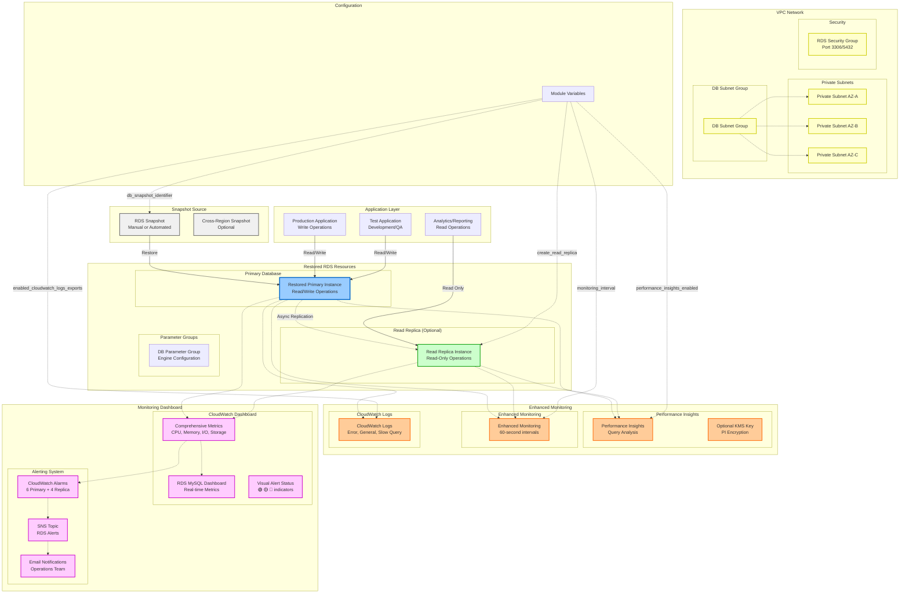

# RDS Restored Module
A Terraform module for restoring AWS RDS database instances from snapshots with optional read replicas, comprehensive monitoring, and production-ready configurations including CloudWatch dashboards and alerting.

## Overview
This module creates a restored RDS deployment with:

- **Snapshot-based restoration** from existing RDS snapshots or automated backups
- **Optional read replica** with independent scaling and monitoring
- **Comprehensive CloudWatch dashboard** with real-time performance monitoring
- **Advanced alerting system** with SNS notifications and replica-specific alarms
- **Performance Insights integration** with optional KMS encryption
- **Enhanced monitoring** with detailed CloudWatch logs export
- **Production-ready features** including backup retention and security configurations

The module is specifically designed for disaster recovery, database migrations, and creating test environments from production snapshots.

## Architecture



## What This Module Creates

### Core Database Infrastructure

**Restored Primary RDS Instance**
- Created from specified snapshot identifier
- Retains original database name, schema, and data
- Configurable instance class and storage settings
- Automatic backup retention with point-in-time recovery
- Performance Insights enabled by default

**Optional Read Replica**
- Asynchronous replication from restored primary
- Independent instance class for cost optimization
- Enhanced monitoring and Performance Insights
- Dedicated CloudWatch alarms for replica health

### Advanced Monitoring Stack

**CloudWatch Dashboard**
- Real-time performance metrics visualization
- Color-coded alert status indicators (🟢 🟡 🔴)
- Comprehensive CPU, memory, I/O, and storage monitoring
- Connection activity and storage management analytics
- Network performance analysis
- Troubleshooting guidance embedded in dashboard

**Performance Insights**
- Query-level performance analysis
- Wait event monitoring
- Database load visualization
- Optional KMS encryption for sensitive environments
- 7-day retention (free tier) or 731-day retention (paid)

**Enhanced Monitoring**
- 60-second granularity monitoring by default
- Detailed OS-level metrics
- Memory and CPU utilization breakdowns
- I/O performance analytics

### Alerting Infrastructure

**SNS Topic and Email Notifications**
- Dedicated SNS topic per database instance
- Email notifications to operations team
- Configurable endpoints for different environments

**Primary Instance Alarms**
- High CPU utilization (>80%)
- Low freeable memory (<200MB)
- Low storage space (<10GB)
- High disk queue depth (>64)
- High database connections (>80)
- Zero connections detected (availability check)

**Read Replica Specific Alarms**
- Replica lag too high (>300 seconds)
- Persistent replication issues (>60s for 20 minutes)
- Write activity detection on replica
- High connections on replica

### Security and Encryption

**Optional KMS Key for Performance Insights**
- Dedicated KMS key for Performance Insights encryption
- Service-specific IAM policies
- Key alias for easy identification
- Automated key rotation support

**CloudWatch Logs Export**
- Error logs for troubleshooting
- General query logs for audit
- Slow query logs for performance optimization
- Configurable log types per database engine

## Usage

### Basic Snapshot Restoration
```hcl
module "rds_restored" {
  source = "../../../modules/rds-restored"

  # Environment configuration
  name_prefix       = "myapp-prod"
  name_prefix_upper = "MYAPP-PROD"
  
  # Snapshot restoration
  db_snapshot_identifier = "rds:myapp-prod-mysql-2024-01-15-03-00"
  db_name_identifier    = "myapp-prod-restored"
  
  # Database credentials
  db_username = "admin"
  db_password = var.db_password
  
  # Instance configuration
  instance_class    = "db.t3.xlarge"
  allocated_storage = 200
  
  # Network configuration
  db_subnet_group_name = aws_db_subnet_group.main.name
  rds_sg_id           = aws_security_group.rds.id
  private_subnet_ids  = data.terraform_remote_state.foundation.outputs.private_subnet_ids
  
  # Security configuration
  storage_encrypted   = true
  publicly_accessible = false
  deletion_protection = true
  skip_final_snapshot = false
  
  # Backup configuration
  backup_retention_period = 7
  
  # Parameter group
  db_parameter_group_name = aws_db_parameter_group.mysql.name
  
  # Enhanced monitoring
  monitoring_role_arn                 = aws_iam_role.rds_enhanced_monitoring.arn
  performance_insights_enabled        = true
  performance_insights_retention_period = 7
  monitoring_interval                 = 60
  enabled_cloudwatch_logs_exports     = ["error", "general", "slowquery"]
  
  # Read replica disabled for basic setup
  create_read_replica = false
  
  tags = {
    Environment = "production"
    Purpose     = "disaster-recovery"
    Source      = "snapshot-restore"
  }
}
```

### Production Setup with Read Replica and Enhanced Monitoring
```hcl
module "rds_restored_with_replica" {
  source = "../../../modules/rds-restored"

  # Environment configuration
  name_prefix       = "analytics-prod"
  name_prefix_upper = "ANALYTICS-PROD"
  
  # Restore from cross-region snapshot
  db_snapshot_identifier = "arn:aws:rds:us-west-2:123456789012:snapshot:analytics-backup-2024-01-15"
  db_name_identifier    = "analytics-prod-restored"
  
  # Credentials from AWS Secrets Manager
  db_username = data.aws_secretsmanager_secret_version.db_creds.username
  db_password = data.aws_secretsmanager_secret_version.db_creds.password
  
  # High-performance instance for analytics workload
  instance_class    = "db.r6g.2xlarge"
  allocated_storage = 1000
  
  # Network configuration
  db_subnet_group_name = aws_db_subnet_group.analytics.name
  rds_sg_id           = aws_security_group.analytics_rds.id
  private_subnet_ids  = var.private_subnet_ids
  
  # Production security settings
  storage_encrypted   = true
  publicly_accessible = false
  deletion_protection = true
  skip_final_snapshot = false
  
  # Extended backup retention
  backup_retention_period = 30
  
  # Custom parameter group for analytics
  db_parameter_group_name = aws_db_parameter_group.analytics_mysql.name
  
  # Enhanced monitoring with all features
  monitoring_role_arn                    = data.terraform_remote_state.foundation.outputs.rds_enhanced_monitoring_role_arn
  performance_insights_enabled           = true
  performance_insights_retention_period  = 731  # Paid tier for 2-year retention
  create_performance_insights_kms_key    = true  # Dedicated encryption key
  monitoring_interval                    = 60
  enabled_cloudwatch_logs_exports        = ["error", "general", "slowquery"]
  
  # Read replica for reporting queries
  create_read_replica    = true
  replica_instance_class = "db.r6g.xlarge"  # Smaller for read workloads
  
  # Custom MySQL parameters for analytics
  mysql_parameters = {
    innodb_buffer_pool_size    = "{DBInstanceClassMemory*3/4}"
    max_connections           = "1000"
    query_cache_size          = "268435456"  # 256MB
    query_cache_type          = "1"
    slow_query_log            = "1"
    long_query_time           = "2"
    log_queries_not_using_indexes = "1"
  }
  
  tags = {
    Environment = "production"
    Application = "analytics"
    DataClass   = "confidential"
    Backup      = "critical"
    Monitoring  = "enhanced"
  }
}
```

### Development Environment from Production Snapshot
```hcl
module "rds_dev_from_prod" {
  source = "../../../modules/rds-restored"

  # Environment configuration
  name_prefix       = "myapp-dev"
  name_prefix_upper = "MYAPP-DEV"
  
  # Restore from latest production snapshot
  db_snapshot_identifier = data.aws_db_snapshot.latest_prod.id
  db_name_identifier    = "myapp-dev-from-prod"
  
  # Development credentials
  db_username = "devadmin"
  db_password = "dev-password-123"
  
  # Smaller instance for development
  instance_class    = "db.t3.medium"
  allocated_storage = 100
  
  # Network configuration
  db_subnet_group_name = aws_db_subnet_group.dev.name
  rds_sg_id           = aws_security_group.dev_rds.id
  private_subnet_ids  = var.dev_private_subnet_ids
  
  # Development-friendly settings
  storage_encrypted   = false  # Not required for dev data
  publicly_accessible = false
  deletion_protection = false  # Allow easy cleanup
  skip_final_snapshot = true   # No snapshot on destroy
  
  # Minimal backup retention
  backup_retention_period = 1
  
  # Default parameter group
  db_parameter_group_name = "default.mysql8.0"
  
  # Basic monitoring
  monitoring_role_arn                    = aws_iam_role.rds_basic_monitoring.arn
  performance_insights_enabled           = true
  performance_insights_retention_period  = 7  # Free tier
  monitoring_interval                    = 60
  enabled_cloudwatch_logs_exports        = ["error"]  # Minimal logging
  
  # No read replica needed for dev
  create_read_replica = false
  
  tags = {
    Environment  = "development"
    Purpose      = "testing"
    DataSource   = "production-snapshot"
    AutoShutdown = "enabled"
  }
}
```

### Cross-Region Disaster Recovery
```hcl
# Data source to find latest snapshot
data "aws_db_snapshot" "latest_production" {
  db_instance_identifier = "myapp-prod-primary"
  most_recent           = true
  snapshot_type         = "automated"
}

module "rds_dr_restore" {
  source = "../../../modules/rds-restored"

  # Disaster recovery configuration
  name_prefix       = "myapp-dr"
  name_prefix_upper = "MYAPP-DR"
  
  # Restore from latest automated snapshot
  db_snapshot_identifier = data.aws_db_snapshot.latest_production.id
  db_name_identifier    = "myapp-dr-standby"
  
  # Credentials must match original database
  db_username = data.aws_secretsmanager_secret_version.prod_db_creds.username
  db_password = data.aws_secretsmanager_secret_version.prod_db_creds.password
  
  # Match production instance specifications
  instance_class    = "db.r6g.xlarge"
  allocated_storage = 500
  
  # DR region network configuration
  db_subnet_group_name = aws_db_subnet_group.dr.name
  rds_sg_id           = aws_security_group.dr_rds.id
  private_subnet_ids  = data.aws_availability_zones.dr.names
  
  # Production-equivalent security
  storage_encrypted   = true
  publicly_accessible = false
  deletion_protection = true
  skip_final_snapshot = false
  
  # Standard backup retention
  backup_retention_period = 7
  
  # DR parameter group
  db_parameter_group_name = aws_db_parameter_group.dr_mysql.name
  
  # Full monitoring for DR environment
  monitoring_role_arn                    = aws_iam_role.dr_rds_monitoring.arn
  performance_insights_enabled           = true
  performance_insights_retention_period  = 7
  monitoring_interval                    = 60
  enabled_cloudwatch_logs_exports        = ["error", "general", "slowquery"]
  
  # No read replica initially (can be added if DR becomes active)
  create_read_replica = false
  
  tags = {
    Environment = "disaster-recovery"
    Purpose     = "standby"
    Region      = "secondary"
    Activation  = "manual"
  }
}
```

## Input Variables

### Required Variables
| Variable | Type | Description |
|----------|------|-------------|
| `name_prefix` | `string` | Prefix for named resources |
| `name_prefix_upper` | `string` | Uppercase prefix for dashboard names |
| `db_snapshot_identifier` | `string` | Snapshot identifier/ARN to restore from |
| `db_name_identifier` | `string` | DB instance identifier |
| `db_username` | `string` | Database master username |
| `db_password` | `string` | Database master password (sensitive) |
| `db_subnet_group_name` | `string` | DB subnet group name |
| `rds_sg_id` | `string` | RDS Security Group ID |
| `db_parameter_group_name` | `string` | DB parameter group name |
| `monitoring_role_arn` | `string` | IAM role ARN for enhanced monitoring |

### Instance Configuration Variables
| Variable | Type | Description |
|----------|------|-------------|
| `instance_class` | `string` | RDS instance class |
| `allocated_storage` | `number` | Allocated storage size (GB) |
| `storage_type` | `string` | Storage type (gp2, gp3, io1, io2) |
| `iops` | `number` | Provisioned IOPS for io1/io2 |
| `storage_throughput` | `number` | Storage throughput for gp3 (MB/s) |
| `max_allocated_storage` | `number` | Maximum storage for auto-scaling |

### Security Configuration Variables
| Variable | Type | Default | Description |
|----------|------|---------|-------------|
| `storage_encrypted` | `bool` | - | Enable storage encryption |
| `publicly_accessible` | `bool` | - | Whether DB is publicly accessible |
| `deletion_protection` | `bool` | - | Enable deletion protection |
| `skip_final_snapshot` | `bool` | - | Skip final snapshot on deletion |
| `backup_retention_period` | `number` | `7` | Backup retention period (1-35 days) |

### Read Replica Configuration Variables
| Variable | Type | Default | Description |
|----------|------|---------|-------------|
| `create_read_replica` | `bool` | `false` | Whether to create a read replica |
| `replica_instance_class` | `string` | `"db.t3.small"` | Instance class for read replica |
| `replica_allocated_storage` | `number` | `null` | Replica storage size (inherits if null) |
| `replica_max_allocated_storage` | `number` | `null` | Replica max storage for auto-scaling |
| `replica_storage_type` | `string` | `null` | Replica storage type (inherits if null) |
| `replica_iops` | `number` | `null` | Replica IOPS (inherits if null) |

### Performance Insights Configuration Variables
| Variable | Type | Default | Description |
|----------|------|---------|-------------|
| `performance_insights_enabled` | `bool` | `true` | Enable Performance Insights |
| `performance_insights_retention_period` | `number` | `7` | Retention period (7 or 731 days) |
| `performance_insights_kms_key_id` | `string` | `null` | KMS key ID for PI encryption |
| `create_performance_insights_kms_key` | `bool` | `false` | Create dedicated KMS key for PI |

### Enhanced Monitoring Configuration Variables
| Variable | Type | Default | Description |
|----------|------|---------|-------------|
| `monitoring_interval` | `number` | `60` | Monitoring interval (0,1,5,10,15,30,60) |
| `enabled_cloudwatch_logs_exports` | `list(string)` | `["error", "general", "slowquery"]` | Log types to export |

### MySQL Parameter Configuration
```hcl
variable "mysql_parameters" {
  description = "Optional map of MySQL parameter overrides"
  type        = map(string)
  default = {
    log_bin_trust_function_creators = "1"
    binlog_format                   = "ROW"
    binlog_row_image                = "FULL"
    wait_timeout                    = "28800"
    interactive_timeout             = "28800"
    net_read_timeout                = "600"
    net_write_timeout               = "600"
  }
}
```

### Optional Variables
| Variable | Type | Default | Description |
|----------|------|---------|-------------|
| `tags` | `map(string)` | `{}` | Extra tags to apply to all resources |
| `private_subnet_ids` | `list(string)` | - | Private subnet IDs for DB subnet group |

## Outputs

### Primary Database Outputs
| Output | Description |
|--------|-------------|
| `db_instance_endpoint` | Primary database connection endpoint |
| `db_instance_identifier` | Primary database instance identifier |
| `db_instance_id` | Primary database instance ID |
| `db_instance_arn` | Primary database instance ARN |

### Read Replica Outputs
| Output | Description |
|--------|-------------|
| `db_replica_endpoint` | Read replica connection endpoint (null if not created) |
| `db_replica_identifier` | Read replica instance identifier (null if not created) |
| `db_replica_id` | Read replica instance ID (null if not created) |
| `db_replica_arn` | Read replica instance ARN (null if not created) |

### Performance Insights Outputs
| Output | Description |
|--------|-------------|
| `rds_performance_insights_enabled` | Whether Performance Insights is enabled |
| `performance_insights_kms_key_id` | KMS key ID for Performance Insights encryption |

## Monitoring and Dashboard Features

### CloudWatch Dashboard Components

**Real-Time Status Indicators**
- Color-coded alert status (🟢 FINE | 🟡 WARNING | 🔴 CRITICAL)
- Current connections with threshold indicators
- Free storage space with capacity warnings
- Live data updates with sparklines

**Performance Analysis Widgets**
- CPU utilization with peak tracking
- CPU credit balance and usage (for burstable instances)
- Memory availability with critical thresholds
- EBS burst balance monitoring
- Swap usage tracking

**Connection and Storage Management**
- Connection activity patterns
- Storage capacity trends
- Binary log usage monitoring
- Historical trend analysis

**I/O Performance Monitoring**
- Read/write latency tracking
- Disk queue depth analysis
- IOPS activity patterns
- Network throughput analysis

**Embedded Troubleshooting Guide**
- Common issue pattern identification
- Alert configuration documentation
- Performance optimization recommendations
- Operational guidance

### Alert Configuration

**Primary Database Alarms**
```hcl
# High CPU Usage (>80%)
alarm_name = "${db_instance_name}-High-CPU"
threshold  = 80
evaluation_periods = 2

# Low Memory (<200MB)
alarm_name = "${db_instance_name}-Low-Memory"  
threshold  = 200000000
evaluation_periods = 2

# Low Storage (<10GB)
alarm_name = "${db_instance_name}-Low-Storage"
threshold  = 10000000000
evaluation_periods = 1

# High Disk Queue (>64)
alarm_name = "${db_instance_name}-High-DiskQueueDepth"
threshold  = 64
evaluation_periods = 2

# High Connections (>80)
alarm_name = "${db_instance_name}-High-Connections"
threshold  = 80
evaluation_periods = 2

# Availability Check (<1 connection)
alarm_name = "${db_instance_name}-Zero-Connections"
threshold  = 1
evaluation_periods = 2
```

**Read Replica Specific Alarms**
```hcl
# Replica Lag (>300 seconds)
alarm_name = "${replica_name}-ReplicaLag-Too-High"
threshold  = 300
evaluation_periods = 2

# Persistent Lag (>60s for 20 minutes)
alarm_name = "${replica_name}-ReplicaSync-Broken"
threshold  = 60
evaluation_periods = 4

# Write Activity Detection (>50 IOPS)
alarm_name = "${replica_name}-Write-Detected"
threshold  = 50
evaluation_periods = 1

# High Replica Connections (>80)
alarm_name = "${replica_name}-High-Connections"
threshold  = 80
evaluation_periods = 2
```

## Snapshot Restoration Best Practices

### Snapshot Selection
1. **Latest Automated Backup**: Use most recent automated backup for minimal data loss
2. **Point-in-Time Recovery**: Specify exact restoration time for precise recovery
3. **Cross-Region Snapshots**: Use cross-region snapshots for disaster recovery
4. **Manual Snapshots**: Use manual snapshots for planned migrations

### Pre-Restoration Planning
1. **Instance Sizing**: Match or upgrade instance class based on expected workload
2. **Storage Configuration**: Consider storage type upgrades during restoration
3. **Network Planning**: Ensure subnet groups and security groups are configured
4. **Parameter Groups**: Prepare parameter groups with appropriate configurations

### Post-Restoration Tasks
1. **Connection Testing**: Verify application connectivity
2. **Performance Validation**: Monitor initial performance metrics
3. **Backup Configuration**: Ensure backup settings meet requirements
4. **Monitoring Setup**: Verify all alarms and dashboard functionality

### Security Considerations
1. **Credential Management**: Update passwords if restoring to different environment
2. **Network Access**: Review security group rules for new environment
3. **Encryption Settings**: Maintain encryption settings appropriate for environment
4. **IAM Permissions**: Ensure proper IAM roles for monitoring and management

## Performance Optimization

### Instance Class Selection
- **Burstable (T3/T4g)**: Development, test, low-traffic applications
- **General Purpose (M6i/M6g)**: Balanced workloads, moderate traffic
- **Memory Optimized (R6g/R6i)**: Analytics, in-memory processing
- **Compute Optimized (C6g/C6i)**: CPU-intensive applications

### Storage Configuration
```hcl
# General Purpose SSD (gp3) - Recommended for most workloads
storage_type      = "gp3"
allocated_storage = 500
storage_throughput = 250  # MB/s

# Provisioned IOPS SSD (io1/io2) - High performance applications
storage_type = "io2"
iops        = 10000
allocated_storage = 1000

# Auto-scaling configuration
max_allocated_storage = 2000  # 2TB maximum
```

### Read Replica Optimization
```hcl
# Cost-optimized read replica
replica_instance_class = "db.t3.large"      # Smaller than primary
replica_storage_type  = "gp2"               # Lower cost storage
replica_allocated_storage = 200             # Minimal storage

# Performance-optimized read replica  
replica_instance_class = "db.r6g.xlarge"    # Memory optimized
replica_storage_type  = "gp3"               # High performance
replica_iops          = 5000                # Dedicated IOPS
```

## Disaster Recovery Strategies

### RTO/RPO Considerations
- **Recovery Time Objective (RTO)**: Time to restore service
- **Recovery Point Objective (RPO)**: Acceptable data loss window
- **Cross-Region Replication**: Minimize RTO with regional failover
- **Multi-AZ Deployment**: Automatic failover within region

### Backup Strategies
```hcl
# Production backup configuration
backup_retention_period = 30        # 30-day retention
skip_final_snapshot    = false      # Always take final snapshot

# Cross-region backup copying (manual setup required)
# Use AWS Backup or Lambda for automated cross-region copying
```

### Failover Procedures
1. **Automated Failover**: Multi-AZ provides automatic failover
2. **Manual Failover**: Cross-region restoration from snapshots
3. **Application Updates**: Update connection strings for failover
4. **DNS Updates**: Update Route53 records for regional failover

## Cost Optimization

### Development Environments
```hcl
# Cost-optimized development setup
instance_class         = "db.t3.micro"     # Minimal instance
allocated_storage      = 20                # Small storage
storage_type          = "gp2"              # Lower cost storage
create_read_replica   = false              # No replica needed
backup_retention_period = 1                # Minimal backups
deletion_protection   = false              # Easy cleanup
```

### Production Cost Management
- **Right-sizing**: Monitor CloudWatch metrics to right-size instances
- **Storage Optimization**: Use gp3 instead of gp2 for better price/performance
- **Reserved Instances**: Use RDS Reserved Instances for predictable workloads
- **Backup Optimization**: Set appropriate retention periods

## Troubleshooting

### Common Restoration Issues

**Snapshot Not Found**
- **Problem**: Specified snapshot identifier doesn't exist
- **Solution**: Verify snapshot exists and check cross-region access

**Incompatible Instance Class**
- **Problem**: Target instance class doesn't support source engine
- **Solution**: Choose compatible instance class for database engine

**Insufficient Storage**
- **Problem**: Allocated storage smaller than snapshot requirements
- **Solution**: Set allocated_storage >= original database size

**Parameter Group Conflicts**
- **Problem**: Parameter group incompatible with restored database
- **Solution**: Use compatible parameter group or default group

### Performance Issues After Restoration

**Slow Query Performance**
- **Problem**: Queries running slower than original database
- **Solution**: Update table statistics, rebuild indexes, check parameter group

**High Memory Usage**
- **Problem**: Memory utilization higher than expected
- **Solution**: Monitor buffer pool usage, adjust parameters, consider instance upgrade

**Replication Lag Issues**
- **Problem**: Read replica showing high lag
- **Solution**: Check replica instance class, network connectivity, and workload patterns

### Monitoring and Alerting Issues

**Dashboard Not Loading**
- **Problem**: CloudWatch dashboard shows no data
- **Solution**: Verify metric names match actual instance identifiers

**Alarms Not Triggering**
- **Problem**: CloudWatch alarms not sending notifications
- **Solution**: Check SNS topic configuration and email subscriptions

**Performance Insights Not Working**
- **Problem**: Performance Insights showing no data
- **Solution**: Verify Performance Insights is enabled and IAM permissions are correct

## Version Requirements

```hcl
terraform {
  required_version = ">= 1.6.0"
  required_providers {
    aws = {
      source  = "hashicorp/aws"
      version = "~> 5.0"
    }
  }
}
```

## Contributing

When contributing to this module:

1. **Maintain Restoration Logic**: Ensure changes don't break snapshot restoration process
2. **Monitor Compatibility**: Test across different MySQL and PostgreSQL versions
3. **Dashboard Updates**: Keep CloudWatch dashboard synchronized with new metrics
4. **Alert Tuning**: Test alert thresholds across different instance types
5. **Documentation**: Update examples for new features and configurations

## Design Decisions

### Why These Choices?

**Snapshot-First Design**: Built specifically for restoration scenarios rather than new database creation.

**Comprehensive Monitoring**: Includes dashboard and alerting to ensure restored databases perform optimally.

**Replica-Specific Alarms**: Dedicated monitoring for read replica health and performance.

**Flexible Parameter Configuration**: Allows MySQL parameter customization while maintaining sensible defaults.

**Performance Insights Integration**: Enables detailed query analysis with optional KMS encryption for security compliance.

**Lifecycle Protection**: Prevents accidental modification of critical database settings during Terraform operations.

This module provides a robust, production-ready solution for database restoration scenarios that balances operational requirements, monitoring capabilities, and cost optimization while maintaining the highest standards of security and reliability.

## MySQL Parameter Optimization

### Default Parameter Configuration
The module includes optimized MySQL parameters for common use cases:

```hcl
mysql_parameters = {
  # Binary logging configuration for replication
  log_bin_trust_function_creators = "1"
  binlog_format                   = "ROW"
  binlog_row_image                = "FULL"
  
  # Connection timeout settings
  wait_timeout                    = "28800"    # 8 hours
  interactive_timeout             = "28800"    # 8 hours
  net_read_timeout                = "600"      # 10 minutes  
  net_write_timeout               = "600"      # 10 minutes
}
```

### Performance Tuning Parameters
For high-performance workloads, consider these additional parameters:

```hcl
# High-performance MySQL configuration
mysql_parameters = {
  # InnoDB buffer pool (75% of available memory)
  innodb_buffer_pool_size         = "{DBInstanceClassMemory*3/4}"
  innodb_buffer_pool_instances    = "8"
  
  # Connection limits
  max_connections                 = "1000"
  max_connect_errors             = "100000"
  
  # Query cache (use with caution in MySQL 8.0+)
  query_cache_size               = "268435456"  # 256MB
  query_cache_type               = "1"
  
  # Slow query logging
  slow_query_log                 = "1"
  long_query_time                = "2"
  log_queries_not_using_indexes  = "1"
  
  # InnoDB performance settings
  innodb_flush_log_at_trx_commit = "2"
  innodb_flush_method            = "O_DIRECT"
  innodb_log_file_size           = "1073741824"  # 1GB
}
```

### Analytics Workload Parameters
For analytics and reporting workloads:

```hcl
# Analytics-optimized MySQL configuration  
mysql_parameters = {
  # Large buffer sizes for analytics
  innodb_buffer_pool_size    = "{DBInstanceClassMemory*7/8}"
  sort_buffer_size           = "16777216"      # 16MB
  read_buffer_size           = "8388608"       # 8MB
  read_rnd_buffer_size       = "16777216"     # 16MB
  
  # Temporary table settings
  tmp_table_size             = "134217728"     # 128MB
  max_heap_table_size        = "134217728"    # 128MB
  
  # Query optimization
  query_cache_size           = "0"            # Disable for analytics
  query_cache_type           = "0"
  
  # Connection settings for long-running queries
  wait_timeout               = "86400"        # 24 hours
  interactive_timeout        = "86400"        # 24 hours
  net_read_timeout           = "3600"         # 1 hour
  net_write_timeout          = "3600"         # 1 hour
}
```

## Snapshot Management

### Automated Snapshot Discovery
```hcl
# Find latest automated snapshot
data "aws_db_snapshot" "latest" {
  db_instance_identifier = "myapp-prod-primary"
  most_recent           = true
  snapshot_type         = "automated"
}

# Use in module
module "rds_restored" {
  source = "../../../modules/rds-restored"
  db_snapshot_identifier = data.aws_db_snapshot.latest.id
  # ... other configuration
}
```

### Cross-Region Snapshot Access
```hcl
# Access snapshot from different region
data "aws_db_snapshot" "cross_region" {
  provider = aws.us_west_2
  
  db_snapshot_identifier = "arn:aws:rds:us-west-2:123456789012:snapshot:prod-backup-20240115"
  include_public        = false
  include_shared        = true
}

module "rds_disaster_recovery" {
  source = "../../../modules/rds-restored"
  db_snapshot_identifier = data.aws_db_snapshot.cross_region.db_snapshot_arn
  # ... other configuration
}
```

### Point-in-Time Recovery
```hcl
# Create snapshot at specific point in time
resource "aws_db_snapshot" "point_in_time" {
  db_instance_identifier = "myapp-prod-primary"
  db_snapshot_identifier = "myapp-recovery-${formatdate("YYYYMMDD-HHmmss", timestamp())}"
  
  tags = {
    Purpose = "point-in-time-recovery"
    Created = timestamp()
  }
}

module "rds_pit_restore" {
  source = "../../../modules/rds-restored"
  db_snapshot_identifier = aws_db_snapshot.point_in_time.id
  # ... other configuration
}
```

## Advanced Monitoring Configuration

### Custom CloudWatch Metrics
```hcl
# Custom metric for application-specific monitoring
resource "aws_cloudwatch_log_metric_filter" "slow_queries" {
  name           = "SlowQueryCount"
  log_group_name = "/aws/rds/instance/${module.rds_restored.db_instance_identifier}/slowquery"
  
  pattern = "[timestamp, thread_id=\"*\", query_time>2, ...]"
  
  metric_transformation {
    name      = "SlowQueryCount"
    namespace = "RDS/CustomMetrics"
    value     = "1"
    
    default_value = 0
  }
}

# Alarm on custom metric
resource "aws_cloudwatch_metric_alarm" "slow_query_alarm" {
  alarm_name          = "${module.rds_restored.db_instance_identifier}-SlowQueries"
  comparison_operator = "GreaterThanThreshold"
  evaluation_periods  = 2
  metric_name         = "SlowQueryCount"
  namespace           = "RDS/CustomMetrics"
  period              = 300
  statistic           = "Sum"
  threshold           = 10
  alarm_description   = "Too many slow queries detected"
}
```

### Enhanced Performance Insights Configuration
```hcl
# Performance Insights with custom KMS key
resource "aws_kms_key" "pi_encryption" {
  description = "Performance Insights encryption for ${var.db_name_identifier}"
  
  policy = jsonencode({
    Version = "2012-10-17"
    Statement = [
      {
        Sid    = "Enable RDS Performance Insights"
        Effect = "Allow"
        Principal = {
          Service = "rds.amazonaws.com"
        }
        Action = [
          "kms:Decrypt",
          "kms:GenerateDataKey"
        ]
        Resource = "*"
      }
    ]
  })
  
  tags = {
    Name    = "${var.db_name_identifier}-pi-key"
    Purpose = "Performance Insights Encryption"
  }
}

module "rds_restored" {
  source = "../../../modules/rds-restored"
  
  # Performance Insights with encryption
  performance_insights_enabled          = true
  performance_insights_retention_period = 731  # 2 years
  performance_insights_kms_key_id      = aws_kms_key.pi_encryption.key_id
  
  # ... other configuration
}
```

### Log Analysis with CloudWatch Insights
```hcl
# CloudWatch Insights queries for log analysis
resource "aws_cloudwatch_query_definition" "error_analysis" {
  name = "RDS Error Analysis - ${var.db_name_identifier}"
  
  log_group_names = [
    "/aws/rds/instance/${var.db_name_identifier}/error"
  ]
  
  query_string = <<EOF
fields @timestamp, @message
| filter @message like /ERROR/
| stats count() by bin(5m)
| sort @timestamp desc
EOF
}

resource "aws_cloudwatch_query_definition" "slow_query_analysis" {
  name = "RDS Slow Query Analysis - ${var.db_name_identifier}"
  
  log_group_names = [
    "/aws/rds/instance/${var.db_name_identifier}/slowquery"
  ]
  
  query_string = <<EOF
fields @timestamp, @message
| filter @message like /Query_time/
| parse @message "Query_time: * Lock_time: * Rows_sent: * Rows_examined: *" as query_time, lock_time, rows_sent, rows_examined
| sort query_time desc
| limit 20
EOF
}
```

## Integration Examples

### Application Load Balancer Health Checks
```hcl
# ALB health check targeting read replica
resource "aws_lb_target_group" "rds_health" {
  name     = "${var.name_prefix}-rds-health"
  port     = 3306
  protocol = "TCP"
  vpc_id   = var.vpc_id
  
  health_check {
    enabled             = true
    healthy_threshold   = 2
    interval            = 30
    matcher             = "200"
    path                = "/health"
    port                = "traffic-port"
    protocol            = "TCP"
    timeout             = 5
    unhealthy_threshold = 2
  }
}

# Register read replica as target
resource "aws_lb_target_group_attachment" "rds_replica" {
  count = var.create_read_replica ? 1 : 0
  
  target_group_arn = aws_lb_target_group.rds_health.arn
  target_id        = module.rds_restored.db_replica_endpoint
  port             = 3306
}
```

### Route53 Health Checks
```hcl
# Route53 health check for database availability
resource "aws_route53_health_check" "rds_primary" {
  fqdn                     = module.rds_restored.db_instance_endpoint
  port                     = 3306
  type                     = "TCP"
  request_interval         = "30"
  failure_threshold        = "3"
  measure_latency          = true
  
  tags = {
    Name = "${var.db_name_identifier}-health-check"
  }
}

# CloudWatch alarm based on health check
resource "aws_cloudwatch_metric_alarm" "route53_health" {
  alarm_name          = "${var.db_name_identifier}-Route53-Health"
  comparison_operator = "LessThanThreshold"
  evaluation_periods  = 2
  metric_name         = "HealthCheckStatus"
  namespace           = "AWS/Route53"
  period              = 60
  statistic           = "Average"
  threshold           = 1
  alarm_description   = "Route53 health check failed for RDS instance"
  
  dimensions = {
    HealthCheckId = aws_route53_health_check.rds_primary.id
  }
}
```

### AWS Backup Integration
```hcl
# AWS Backup plan for additional protection
resource "aws_backup_plan" "rds_backup" {
  name = "${var.db_name_identifier}-backup-plan"
  
  rule {
    rule_name         = "rds_backup_rule"
    target_vault_name = aws_backup_vault.rds.name
    schedule          = "cron(0 2 * * ? *)"  # Daily at 2 AM
    
    start_window      = 60   # 1 hour
    completion_window = 120  # 2 hours
    
    recovery_point_tags = {
      BackupPlan = "${var.db_name_identifier}-backup-plan"
      Source     = "aws-backup"
    }
    
    lifecycle {
      delete_after = 30  # 30 days retention
    }
  }
}

resource "aws_backup_selection" "rds_selection" {
  iam_role_arn = aws_iam_role.backup.arn
  name         = "${var.db_name_identifier}-backup-selection"
  plan_id      = aws_backup_plan.rds_backup.id
  
  resources = [
    module.rds_restored.db_instance_arn
  ]
  
  condition {
    string_equals {
      key   = "aws:ResourceTag/BackupEnabled"
      value = "true"
    }
  }
}
```

This comprehensive documentation provides everything needed to successfully deploy, monitor, and maintain RDS instances restored from snapshots, with production-ready monitoring, alerting, and operational guidance.