# RDS Module
A Terraform module for deploying AWS RDS database instances with optional read replicas, comprehensive security features, and production-ready configurations.

## Overview
This module creates a robust RDS deployment with:

- **Primary RDS instance** with configurable engine and specifications
- **Optional read replica** for improved read performance and availability
- **Security-first approach** with VPC integration and encryption support
- **Production-ready features** including Multi-AZ, backup retention, and deletion protection
- **Flexible configuration** supporting MySQL, PostgreSQL, and other RDS engines
- **Lifecycle management** with protection against accidental modifications

The module follows AWS best practices for database security, performance, and reliability.

## Architecture

```mermaid
graph TB
    subgraph "VPC Network"
        subgraph "Private Subnets"
            SUBNET1[Private Subnet AZ-A]
            SUBNET2[Private Subnet AZ-B]
            SUBNET3[Private Subnet AZ-C]
        end
        
        subgraph "DB Subnet Group"
            DSG[DB Subnet Group]
            DSG -.-> SUBNET1
            DSG -.-> SUBNET2 
            DSG -.-> SUBNET3
        end
        
        subgraph "Security"
            SG[RDS Security Group<br/>Port 3306/5432]
        end
    end

    subgraph "RDS Resources"
        subgraph "Primary Database"
            PRIMARY[Primary RDS Instance<br/>Read/Write Operations]
        end
        
        subgraph "Read Replica (Optional)"
            REPLICA[Read Replica Instance<br/>Read-Only Operations]
            PRIMARY -.->|Async Replication| REPLICA
        end
        
        subgraph "Parameter Groups"
            PARAM[DB Parameter Group<br/>Engine Configuration]
        end
    end

    subgraph "Application Layer"
        APP1[Web Application<br/>Write Operations]
        APP2[Analytics/Reporting<br/>Read Operations]
        
        APP1 -->|Read/Write| PRIMARY
        APP2 -->|Read Only| REPLICA
    end

    subgraph "Storage & Backup"
        STORAGE[EBS Storage<br/>GP2/GP3/IO1]
        BACKUP[Automated Backups<br/>Point-in-Time Recovery]
        SNAPSHOT[Final Snapshot<br/>Manual Snapshots]
        
        PRIMARY -.-> STORAGE
        PRIMARY -.-> BACKUP
        PRIMARY -.-> SNAPSHOT
    end

    subgraph "Security Features"
        ENCRYPT[Storage Encryption<br/>KMS/AES-256]
        IAM[IAM Database Auth<br/>Token-based Access]
        VPC[VPC Security<br/>Private Network]
        
        PRIMARY -.-> ENCRYPT
        PRIMARY -.-> IAM
        PRIMARY -.-> VPC
    end

    subgraph "Availability Features"
        MAZ[Multi-AZ Deployment<br/>Automatic Failover]
        MONITOR[CloudWatch Monitoring<br/>Performance Insights]
        
        PRIMARY -.-> MAZ
        PRIMARY -.-> MONITOR
        REPLICA -.-> MONITOR
    end

    subgraph "Configuration"
        CONFIG[Module Variables]
        CONFIG -.-> |db_subnet_group_name| DSG
        CONFIG -.-> |rds_sg_id| SG
        CONFIG -.-> |create_read_replica| REPLICA
        CONFIG -.-> |multi_az| MAZ
        CONFIG -.-> |storage_encrypted| ENCRYPT
        CONFIG -.-> |deletion_protection| PRIMARY
    end

    classDef primary fill:#99ccff,stroke:#0066cc,stroke-width:3px
    classDef replica fill:#ccffcc,stroke:#009900,stroke-width:2px
    classDef security fill:#ffcc99,stroke:#ff6600,stroke-width:2px
    classDef storage fill:#ffccff,stroke:#cc00cc,stroke-width:2px
    classDef network fill:#ffffcc,stroke:#cccc00,stroke-width:2px

    class PRIMARY primary
    class REPLICA replica
    class SG,ENCRYPT,IAM,VPC security
    class STORAGE,BACKUP,SNAPSHOT storage
    class SUBNET1,SUBNET2,SUBNET3,DSG network
```



## What This Module Creates

### Core Database Infrastructure

**Primary RDS Instance**
- Configurable database engine (MySQL, PostgreSQL, etc.)
- Flexible instance classes from `db.t3.micro` to `db.r6g.16xlarge`
- Custom database name, username, and password configuration
- Lifecycle rules to prevent accidental credential changes

**Optional Read Replica**
- Asynchronous replication from primary instance
- Independent instance class configuration for cost optimization
- Same security group and subnet group as primary
- Automatic tagging with `Role = "read-replica"`

**Storage Configuration**
- Multiple storage types: `gp2`, `gp3`, `io1`, `io2`
- Configurable allocated storage size
- Optional storage encryption with KMS
- Automated storage scaling capabilities

### Security Features

**Network Security**
- VPC-only deployment with private subnets
- Custom security group integration
- No public accessibility by default
- DB subnet group for multi-AZ placement

**Data Protection**
- Storage encryption at rest
- IAM database authentication support
- Automated backup with configurable retention
- Deletion protection to prevent accidental deletion

**Access Control**
- Username/password authentication
- Optional IAM database authentication
- Security group-based network access control
- VPC endpoint support for enhanced security

### High Availability & Performance

**Multi-AZ Deployment**
- Automatic failover to standby instance
- Synchronous replication for data durability
- Enhanced availability during maintenance
- Zero-downtime minor version upgrades

**Backup & Recovery**
- Automated daily backups with point-in-time recovery
- Configurable backup retention period (1-35 days)
- Copy tags to snapshots for consistent management
- Optional final snapshot on termination

**Performance Optimization**
- Read replica for scaling read workloads
- Parameter group customization
- Performance Insights integration
- CloudWatch monitoring included

## Usage

### Basic MySQL Database
```hcl
module "mysql_database" {
  source = "../../../modules/rds"

  # Environment configuration
  name_prefix = "myapp-prod"
  
  # Database configuration
  db_name_identifier = "myapp-prod-mysql"
  db_database        = "myapp_production"
  db_username        = "admin"
  db_password        = var.db_password  # Use variable for security
  
  # Engine configuration
  engine         = "mysql"
  engine_version = "8.0.35"
  instance_class = "db.t3.medium"
  
  # Storage configuration
  allocated_storage = 100
  storage_type     = "gp3"
  storage_encrypted = true
  
  # Network configuration
  db_subnet_group_name = aws_db_subnet_group.main.name
  rds_sg_id           = aws_security_group.rds.id
  
  # Security configuration
  publicly_accessible                 = false
  deletion_protection                 = true
  iam_database_authentication_enabled = true
  
  # Backup configuration
  backup_retention_period    = 14
  skip_final_snapshot       = false
  auto_minor_version_upgrade = true
  
  # High availability
  multi_az = true
  
  # Read replica
  create_read_replica    = false
  replica_instance_class = "db.t3.small"
  
  # Parameter group
  db_parameter_group_name = aws_db_parameter_group.mysql.name
  
  tags = {
    Environment = "production"
    Application = "myapp"
    Backup      = "required"
  }
}
```

### PostgreSQL with Read Replica
```hcl
module "postgres_database" {
  source = "../../../modules/rds"

  # Environment configuration  
  name_prefix = "analytics-prod"
  
  # Database configuration
  db_name_identifier = "analytics-postgres"
  db_database        = "analytics"
  db_username        = "postgres"
  db_password        = random_password.db_password.result
  
  # PostgreSQL engine
  engine         = "postgres"
  engine_version = "15.4"
  instance_class = "db.r6g.xlarge"
  
  # Storage for analytics workload
  allocated_storage = 500
  storage_type     = "gp3"
  storage_encrypted = true
  
  # Network configuration
  db_subnet_group_name = aws_db_subnet_group.analytics.name
  rds_sg_id           = aws_security_group.postgres_rds.id
  
  # Security configuration
  publicly_accessible                 = false
  deletion_protection                 = true
  iam_database_authentication_enabled = true
  
  # Extended backup for compliance
  backup_retention_period    = 30
  skip_final_snapshot       = false
  auto_minor_version_upgrade = false  # Manual control for production
  
  # Multi-AZ for high availability
  multi_az = true
  
  # Read replica for reporting queries
  create_read_replica    = true
  replica_instance_class = "db.r6g.large"  # Smaller for read workloads
  
  # Custom parameter group
  db_parameter_group_name = aws_db_parameter_group.postgres15.name
  
  tags = {
    Environment = "production"
    Application = "analytics"
    DataClass   = "sensitive"
    Backup      = "extended"
  }
}
```

### Development Environment
```hcl
module "dev_database" {
  source = "../../../modules/rds"

  # Environment configuration
  name_prefix = "myapp-dev"
  
  # Database configuration
  db_name_identifier = "myapp-dev-mysql"
  db_database        = "myapp_dev"
  db_username        = "devuser"
  db_password        = "dev-password-123"  # OK for dev environment
  
  # Minimal engine configuration
  engine         = "mysql"
  engine_version = "8.0.35"
  instance_class = "db.t3.micro"
  
  # Minimal storage
  allocated_storage = 20
  storage_type     = "gp2"
  storage_encrypted = false  # Not required for dev
  
  # Network configuration
  db_subnet_group_name = aws_db_subnet_group.dev.name
  rds_sg_id           = aws_security_group.dev_rds.id
  
  # Development-friendly settings
  publicly_accessible                 = false
  deletion_protection                 = false  # Allow easy cleanup
  iam_database_authentication_enabled = false
  
  # Minimal backup
  backup_retention_period    = 1
  skip_final_snapshot       = true  # No snapshot needed
  auto_minor_version_upgrade = true
  
  # Single AZ for cost savings
  multi_az = false
  
  # No read replica needed
  create_read_replica = false
  
  # Default parameter group
  db_parameter_group_name = "default.mysql8.0"
  
  tags = {
    Environment = "development"
    Application = "myapp"
    AutoShutdown = "enabled"
  }
}
```

### Subnet Group and Security Group Example
```hcl
# DB Subnet Group
resource "aws_db_subnet_group" "main" {
  name       = "${var.name_prefix}-db-subnet-group"
  subnet_ids = [aws_subnet.private_1.id, aws_subnet.private_2.id, aws_subnet.private_3.id]

  tags = {
    Name = "${var.name_prefix} DB subnet group"
  }
}

# RDS Security Group
resource "aws_security_group" "rds" {
  name_description = "${var.name_prefix}-rds-sg"
  vpc_id          = aws_vpc.main.id

  # MySQL/Aurora access from application
  ingress {
    from_port       = 3306
    to_port         = 3306
    protocol        = "tcp"
    security_groups = [aws_security_group.app.id]
  }

  # PostgreSQL access from application
  ingress {
    from_port       = 5432
    to_port         = 5432
    protocol        = "tcp"  
    security_groups = [aws_security_group.app.id]
  }

  egress {
    from_port   = 0
    to_port     = 0
    protocol    = "-1"
    cidr_blocks = ["0.0.0.0/0"]
  }

  tags = {
    Name = "${var.name_prefix}-rds-sg"
  }
}
```

## Input Variables

### Required Variables
| Variable | Type | Description |
|----------|------|-------------|
| `name_prefix` | `string` | Prefix for named resources |
| `db_name_identifier` | `string` | DB instance identifier |
| `db_database` | `string` | Database name |
| `db_username` | `string` | Database master username |
| `db_password` | `string` | Database master password |
| `db_subnet_group_name` | `string` | DB subnet group name |
| `rds_sg_id` | `string` | RDS Security Group ID |
| `db_parameter_group_name` | `string` | DB parameter group name |

### Engine Configuration Variables
| Variable | Type | Description |
|----------|------|-------------|
| `engine` | `string` | Database engine (mysql, postgres, etc.) |
| `engine_version` | `string` | Database engine version |
| `instance_class` | `string` | RDS instance class |

### Storage Configuration Variables  
| Variable | Type | Description |
|----------|------|-------------|
| `allocated_storage` | `number` | Allocated storage size (GB) |
| `storage_type` | `string` | Storage type (gp2, gp3, io1, io2) |
| `storage_encrypted` | `bool` | Enable storage encryption |

### Security Configuration Variables
| Variable | Type | Default | Description |
|----------|------|---------|-------------|
| `publicly_accessible` | `bool` | - | Whether DB is publicly accessible |
| `deletion_protection` | `bool` | - | Enable deletion protection |
| `iam_database_authentication_enabled` | `bool` | - | Enable IAM database authentication |

### Availability Configuration Variables
| Variable | Type | Default | Description |
|----------|------|---------|-------------|
| `multi_az` | `bool` | - | Enable Multi-AZ deployment |
| `auto_minor_version_upgrade` | `bool` | - | Enable automatic minor version upgrades |

### Backup Configuration Variables
| Variable | Type | Default | Description |
|----------|------|---------|-------------|
| `backup_retention_period` | `number` | `7` | Backup retention period (1-35 days) |
| `skip_final_snapshot` | `bool` | - | Skip final snapshot on deletion |

### Read Replica Configuration Variables
| Variable | Type | Description |
|----------|------|-------------|
| `create_read_replica` | `bool` | Whether to create a read replica |
| `replica_instance_class` | `string` | Instance class for read replica |

### Optional Variables
| Variable | Type | Default | Description |
|----------|------|---------|-------------|
| `tags` | `map(string)` | `{}` | Extra tags to apply to all resources |
| `db_snapshot_identifier` | `string` | `""` | Snapshot ID to restore from |

## Outputs

### Primary Database Outputs
| Output | Description |
|--------|-------------|
| `db_instance_endpoint` | Primary database connection endpoint |
| `db_instance_identifier` | Primary database instance identifier |
| `db_instance_id` | Primary database instance ID |
| `db_instance_arn` | Primary database instance ARN |

### Read Replica Outputs  
| Output | Description |
|--------|-------------|
| `db_replica_endpoint` | Read replica connection endpoint (null if not created) |
| `db_replica_identifier` | Read replica instance identifier (null if not created) |
| `db_replica_id` | Read replica instance ID (null if not created) |
| `db_replica_arn` | Read replica instance ARN (null if not created) |

## Database Engine Support

### MySQL
**Supported Versions**: 5.7.x, 8.0.x
**Default Port**: 3306
**Parameter Groups**: 
- `default.mysql5.7` 
- `default.mysql8.0`
- Custom parameter groups for performance tuning

**Common Configuration**:
```hcl
engine         = "mysql"
engine_version = "8.0.35"
# Port 3306 in security group
```

### PostgreSQL  
**Supported Versions**: 11.x, 12.x, 13.x, 14.x, 15.x
**Default Port**: 5432
**Parameter Groups**:
- `default.postgres11`
- `default.postgres12` 
- `default.postgres13`
- `default.postgres14`
- `default.postgres15`

**Common Configuration**:
```hcl
engine         = "postgres"
engine_version = "15.4"
# Port 5432 in security group
```

### MariaDB
**Supported Versions**: 10.4.x, 10.5.x, 10.6.x
**Default Port**: 3306
**Parameter Groups**:
- `default.mariadb10.4`
- `default.mariadb10.5`
- `default.mariadb10.6`

### Aurora MySQL/PostgreSQL
**Note**: This module is designed for standard RDS instances. For Aurora clusters, use a dedicated Aurora module.

## Instance Class Recommendations

### Development/Testing
- **db.t3.micro** - 1 vCPU, 1 GB RAM - Minimal workloads
- **db.t3.small** - 1 vCPU, 2 GB RAM - Light development
- **db.t3.medium** - 2 vCPU, 4 GB RAM - Standard development

### Production Workloads
- **db.t3.large** - 2 vCPU, 8 GB RAM - Small production apps
- **db.m6i.xlarge** - 4 vCPU, 16 GB RAM - Medium production workloads
- **db.r6g.2xlarge** - 8 vCPU, 64 GB RAM - Memory-intensive applications
- **db.r6g.4xlarge** - 16 vCPU, 128 GB RAM - Large databases

### High-Performance Applications
- **db.r6i.8xlarge** - 32 vCPU, 256 GB RAM - Very large databases
- **db.x2g.large** - 4 vCPU, 64 GB RAM - Memory-optimized workloads
- **db.r6g.16xlarge** - 64 vCPU, 512 GB RAM - Enterprise workloads

## Storage Types and Performance

### General Purpose SSD (gp2)
- **Use Case**: Balanced price/performance
- **IOPS**: Baseline 3 IOPS/GB, burst to 3000 IOPS
- **Size Range**: 20 GB - 65 TiB
- **Best For**: Most workloads

### General Purpose SSD (gp3)
- **Use Case**: Predictable performance
- **IOPS**: 3000 baseline, configurable up to 16000
- **Throughput**: 125 MB/s baseline, configurable up to 1000 MB/s
- **Size Range**: 20 GB - 65 TiB  
- **Best For**: Applications requiring consistent performance

### Provisioned IOPS SSD (io1/io2)
- **Use Case**: High-performance applications
- **IOPS**: Up to 64000 IOPS (io2), 32000 IOPS (io1)
- **Size Range**: 100 GB - 65 TiB
- **Best For**: I/O intensive applications, large databases

## Security Best Practices

### Network Security
1. **VPC-Only Deployment**: Always deploy in private subnets
2. **Security Groups**: Use restrictive security group rules
3. **No Public Access**: Set `publicly_accessible = false`
4. **VPC Endpoints**: Use VPC endpoints for AWS service access

### Data Protection
1. **Encryption at Rest**: Enable `storage_encrypted = true`
2. **Encryption in Transit**: Use SSL/TLS connections
3. **IAM Authentication**: Enable `iam_database_authentication_enabled = true`
4. **Strong Passwords**: Use complex passwords or AWS Secrets Manager

### Access Control
1. **Least Privilege**: Grant minimal required permissions
2. **Separate Users**: Create application-specific database users
3. **Connection Limits**: Configure max_connections in parameter groups
4. **Audit Logging**: Enable audit logging for compliance

### Backup and Recovery
1. **Backup Retention**: Set appropriate `backup_retention_period`
2. **Final Snapshots**: Set `skip_final_snapshot = false` for production
3. **Cross-Region Backups**: Consider cross-region snapshot copying
4. **Testing Recovery**: Regularly test backup restoration procedures

## High Availability Patterns

### Multi-AZ Deployment
```hcl
# Primary with automatic failover
multi_az = true

# Synchronous replication to standby
# Automatic failover in case of failure
# Zero data loss during failover
```

### Read Replica Pattern
```hcl
# Scale read workloads
create_read_replica    = true
replica_instance_class = "db.t3.large"

# Application reads from replica
# Primary handles writes only
# Eventually consistent reads
```

### Cross-Region Read Replicas
```hcl
# Create replica in different region (manual setup)
# Disaster recovery capability
# Lower latency for global users
# Independent security groups and subnets
```

## Monitoring and Alerting

### CloudWatch Metrics
- **CPU Utilization**: Monitor sustained high CPU usage
- **Database Connections**: Track connection count vs limits
- **Free Storage Space**: Monitor available disk space
- **Read/Write Latency**: Track query performance
- **IOPS Utilization**: Monitor I/O performance

### Performance Insights
- **Enable Performance Insights**: Built-in database performance monitoring
- **Query Analysis**: Identify slow queries and bottlenecks
- **Wait Events**: Understand database wait conditions
- **Historical Data**: Track performance trends over time

### Recommended CloudWatch Alarms
```hcl
resource "aws_cloudwatch_metric_alarm" "rds_cpu" {
  alarm_name          = "${var.name_prefix}-rds-cpu-high"
  comparison_operator = "GreaterThanThreshold"
  evaluation_periods  = "2"
  metric_name         = "CPUUtilization"
  namespace           = "AWS/RDS"
  period              = "300"
  statistic           = "Average"
  threshold           = "80"
  alarm_description   = "This metric monitors RDS CPU utilization"
  
  dimensions = {
    DBInstanceIdentifier = module.rds.db_instance_identifier
  }
}

resource "aws_cloudwatch_metric_alarm" "rds_free_space" {
  alarm_name          = "${var.name_prefix}-rds-low-storage"
  comparison_operator = "LessThanThreshold"
  evaluation_periods  = "1"
  metric_name         = "FreeStorageSpace"
  namespace           = "AWS/RDS"
  period              = "300"
  statistic           = "Average"
  threshold           = "2000000000"  # 2GB in bytes
  alarm_description   = "This metric monitors RDS free storage space"
  
  dimensions = {
    DBInstanceIdentifier = module.rds.db_instance_identifier
  }
}
```

## Troubleshooting

### Common Issues

**Connection Timeouts**
- **Problem**: Applications cannot connect to database
- **Solution**: Check security group rules, subnet group configuration, and VPC routing

**Storage Space Issues**
- **Problem**: Database running out of space
- **Solution**: Monitor FreeStorageSpace metric, enable storage autoscaling, or manually increase allocated_storage

**Performance Problems**
- **Problem**: Slow query performance
- **Solution**: Check Performance Insights, optimize queries, consider read replicas, upgrade instance class

**Backup Failures**
- **Problem**: Automated backups failing
- **Solution**: Verify IAM permissions, check storage space, review CloudWatch logs

**Parameter Group Changes Not Applied**
- **Problem**: Parameter changes not taking effect
- **Solution**: Reboot database instance or use dynamic parameters where possible

### Maintenance Windows
- **Default Window**: Sunday 03:00-04:00 UTC
- **Custom Window**: Configure during low-traffic periods
- **Auto Minor Upgrades**: Enable for security patches
- **Major Upgrades**: Always test in staging first

### Cost Optimization

**Right-Sizing Instances**
1. Monitor CloudWatch metrics for CPU and memory usage
2. Consider burstable instances (t3) for variable workloads
3. Use read replicas to scale reads instead of larger primary

**Storage Optimization**
1. Start with gp2, upgrade to gp3 for better price/performance
2. Monitor IOPS usage before using Provisioned IOPS
3. Enable storage autoscaling to avoid over-provisioning

**Backup Cost Management**
1. Set appropriate backup retention periods
2. Delete unnecessary manual snapshots
3. Consider automated snapshot lifecycle policies

## Lifecycle Management

### Credential Protection
```hcl
lifecycle {
  ignore_changes = [
    db_name,    # Prevent accidental database recreation
    username,   # Protect master username
    password,   # Protect master password
  ]
}
```

### Deletion Protection
- **Production**: Always enable `deletion_protection = true`
- **Development**: Can disable for easier cleanup
- **Final Snapshots**: Enable `skip_final_snapshot = false` for data recovery

### Version Upgrades
- **Auto Minor**: Enable `auto_minor_version_upgrade = true` for security patches
- **Manual Major**: Plan and test major version upgrades carefully
- **Staging First**: Always upgrade staging environment first

## Contributing

When contributing to this module:

1. **Maintain Compatibility**: Ensure changes don't break existing deployments
2. **Security Focus**: Default to secure configurations
3. **Documentation**: Update variable descriptions and examples
4. **Testing**: Test across multiple engines and instance types
5. **Best Practices**: Follow AWS RDS best practices

## Design Decisions

### Why These Choices?

**Lifecycle Management**: Protects against accidental credential changes that would force database recreation.

**Flexible Read Replicas**: Optional read replicas with independent instance class allow cost optimization.

**Security by Default**: Private subnets, encryption, and deletion protection prioritize security.

**Comprehensive Outputs**: Both primary and replica outputs support complex application architectures.

**Tag Inheritance**: Automatic tagging with role identification aids in management and monitoring.

This module provides a production-ready RDS deployment that balances security, performance, availability, and cost considerations while remaining flexible enough for various use cases from development to enterprise production workloads.