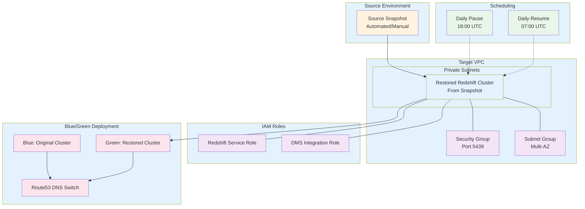

# Redshift Restore Module

A Terraform module for creating AWS Redshift clusters from existing snapshots, enabling fast cluster recovery, blue/green deployments, and environment cloning with automated scheduling and security configurations.

## Overview

This module creates a Redshift cluster from a snapshot with:
- **Snapshot-based restoration** for rapid cluster deployment
- **Configuration flexibility** to override snapshot settings
- **Automated scheduling** with daily pause/resume for cost optimization  
- **Security-first approach** with VPC integration and encryption options
- **Blue/Green deployment support** through companion main Redshift module
- **Environment cloning** capabilities for testing and development

## Architecture



## What This Module Creates

### Core Restoration Infrastructure

#### Restored Redshift Cluster
- **Cluster from snapshot** with original data preserved
- **Configurable overrides** for node type, credentials, and networking
- **New cluster identifier** to avoid naming conflicts
- **Automatic role attachment** for seamless operation

#### Flexible Configuration Override
- **Node Type**: Can upgrade/downgrade from original snapshot
- **Network Settings**: Deploy to different VPC/subnets than original
- **Security Groups**: Apply new security configurations
- **Encryption**: Enable encryption on previously unencrypted snapshots

#### Data Preservation
- **Full data restoration** from point-in-time snapshot
- **Schema preservation** with all tables, views, and permissions
- **User accounts** restored from snapshot (where applicable)
- **Database settings** inherited from snapshot source

### Cost Optimization Features

#### Automated Scheduling (Identical to Main Module)
- **Daily Pause**: Automatically pauses cluster at 18:00 UTC (6 PM)
- **Daily Resume**: Automatically resumes cluster at 07:00 UTC (7 AM)  
- **Weekend Coverage**: Runs 7 days a week for consistent schedule
- **Cost Savings**: Up to 65% cost reduction during off-hours

## Usage

### Basic Snapshot Restoration

```hcl
module "redshift_restore" {
  source = "../modules/redshift-restore"
  
  # Snapshot Configuration
  redshift_cluster_identifier_name = "prod-analytics-restored"
  redshift_snapshot_identifier     = "prod-analytics-final-snapshot-2024-01-15"
  
  # Override node type (can upgrade/downgrade)
  redshift_node_type = "ra3.4xlarge"  # Upgrade from original
  
  # Database Configuration (overrides)
  redshift_database_name = "analytics"
  redshift_username      = "admin"
  redshift_port          = 5439
  
  # Network Configuration (can deploy to different VPC)
  redshift_subnet_group_name = aws_redshift_subnet_group.new_env.name
  redshift_sg_id            = aws_security_group.redshift_new.id
  
  # Security Configuration
  redshift_publicly_accessible  = false
  redshift_encrypted            = true   # Enable encryption if source wasn't encrypted
  redshift_enhanced_vpc_routing = true
  redshift_skip_final_snapshot  = false
  
  # IAM Roles
  redshift_role_arn     = aws_iam_role.redshift_role.arn
  redshift_dms_role_arn = aws_iam_role.dms_redshift_role.arn
  
  # Scheduling
  redshift_daily_pause  = "restored-redshift-daily-pause"
  redshift_daily_resume = "restored-redshift-daily-resume"
}
```

### Blue/Green Deployment Pattern

This module works seamlessly with the **main Redshift module** for zero-downtime deployments:

```hcl
# Conditional deployment based on restoration flag
locals {
  restore_redshift_from_snapshot = true  # Toggle for blue/green
  active_color                  = "green" # Which environment is live
}

# Green Environment (Restored from Snapshot)
module "redshift_restore" {
  source = "../modules/redshift-restore"
  count  = local.restore_redshift_from_snapshot ? 1 : 0
  
  redshift_cluster_identifier_name = "green-analytics-cluster"
  redshift_snapshot_identifier     = "blue-analytics-final-snapshot"
  
  # Configuration...
}

# Blue Environment (Original/Fresh Cluster)  
module "redshift" {
  source = "../modules/redshift"
  count  = local.restore_redshift_from_snapshot ? 0 : 1
  
  redshift_cluster_identifier_name = "blue-analytics-cluster"
  
  # Configuration...
}

# DNS Switching for Zero-Downtime Deployment
resource "aws_route53_record" "live_redshift" {
  zone_id = data.aws_route53_zone.main.zone_id
  name    = "redshift.example.com"
  type    = "CNAME"
  ttl     = 60
  
  records = [
    local.restore_redshift_from_snapshot
    ? module.redshift_restore[0].redshift_endpoint_address
    : module.redshift[0].redshift_endpoint_address
  ]
}

# Test Environment (Always points to non-live environment)
resource "aws_route53_record" "test_redshift" {
  zone_id = data.aws_route53_zone.main.zone_id
  name    = "test-redshift.example.com"
  type    = "CNAME"
  ttl     = 60
  
  records = [
    local.active_color == "green"
    # If green is live, test points to blue
    ? module.redshift[0].redshift_endpoint_address  
    # If blue is live, test points to green
    : module.redshift_restore[0].redshift_endpoint_address
  ]
}
```

### Environment Cloning

```hcl
# Clone production to staging
module "staging_redshift" {
  source = "../modules/redshift-restore"
  
  # Clone from production snapshot
  redshift_cluster_identifier_name = "staging-analytics-cluster"
  redshift_snapshot_identifier     = "prod-analytics-nightly-snapshot"
  
  # Downsize for staging environment
  redshift_node_type = "dc2.large"  # Smaller than production
  
  # Staging-specific configuration
  redshift_database_name = "staging_analytics"
  redshift_username      = "staging_admin"
  
  # Use staging network resources
  redshift_subnet_group_name = aws_redshift_subnet_group.staging.name
  redshift_sg_id            = aws_security_group.redshift_staging.id
  
  # Cost optimization for staging
  redshift_skip_final_snapshot = true
  redshift_encrypted          = false  # Optional for staging
  
  # IAM roles
  redshift_role_arn     = aws_iam_role.redshift_staging_role.arn
  redshift_dms_role_arn = aws_iam_role.dms_staging_role.arn
  
  # Scheduling
  redshift_daily_pause  = "staging-redshift-daily-pause"
  redshift_daily_resume = "staging-redshift-daily-resume"
}
```

## Input Variables

### Required Variables

| Variable | Type | Description | Example |
|----------|------|-------------|---------|
| `redshift_cluster_identifier_name` | `string` | New unique identifier for restored cluster | `"prod-analytics-restored"` |
| `redshift_snapshot_identifier` | `string` | Identifier of the snapshot to restore from | `"prod-cluster-snapshot-2024"` |
| `redshift_node_type` | `string` | Node type (can differ from snapshot original) | `"ra3.4xlarge"` |
| `redshift_database_name` | `string` | Database name (override from snapshot) | `"analytics"` |
| `redshift_username` | `string` | Master username (override from snapshot) | `"admin"` |

### Network Configuration Variables

| Variable | Type | Description |
|----------|------|-------------|
| `redshift_port` | `number` | Port for Redshift connections (typically 5439) |
| `redshift_subnet_group_name` | `string` | Subnet group for VPC deployment (can be different from original) |
| `redshift_sg_id` | `string` | Security group ID for network access control |

### Security Configuration Variables

| Variable | Type | Description |
|----------|------|-------------|
| `redshift_publicly_accessible` | `bool` | Whether cluster is publicly accessible (recommend: false) |
| `redshift_encrypted` | `bool` | Enable encryption (can encrypt previously unencrypted snapshots) |
| `redshift_enhanced_vpc_routing` | `bool` | Enable enhanced VPC routing for better security |
| `redshift_skip_final_snapshot` | `bool` | Skip final snapshot on cluster deletion |

### IAM Role Variables

| Variable | Type | Description |
|----------|------|-------------|
| `redshift_role_arn` | `string` | ARN of the Redshift service role |
| `redshift_dms_role_arn` | `string` | ARN of the DMS integration role |

### Scheduling Variables

| Variable | Type | Description |
|----------|------|-------------|
| `redshift_daily_pause` | `string` | Name for the daily pause scheduled action |
| `redshift_daily_resume` | `string` | Name for the daily resume scheduled action |

## Outputs

| Output | Description |
|--------|-------------|
| `redshift_endpoint` | Full Redshift cluster endpoint (hostname:port) |
| `redshift_endpoint_address` | Hostname only (used for DNS CNAME records) |
| `redshift_port` | Port number the cluster is listening on |
| `redshift_database_name` | Default database name |
| `redshift_cluster_identifier` | Unique cluster identifier |
| `redshift_arn` | ARN of the Redshift cluster |

### Using Outputs

```hcl
# Create DNS record pointing to restored cluster
resource "aws_route53_record" "redshift_restored" {
  name    = "redshift-restored.example.com"
  type    = "CNAME"
  records = [module.redshift_restore.redshift_endpoint_address]
}

# Reference in application configuration
resource "aws_ssm_parameter" "redshift_endpoint" {
  name  = "/app/redshift/restored/endpoint"
  value = module.redshift_restore.redshift_endpoint
}
```

## Snapshot Requirements

### Valid Snapshot Sources

The module can restore from various snapshot types:

#### Automatic Snapshots
```hcl
# Daily automatic snapshot
redshift_snapshot_identifier = "rs:prod-cluster-2024-01-15-05-30"
```

#### Manual Snapshots
```hcl
# User-created snapshot
redshift_snapshot_identifier = "prod-cluster-migration-snapshot"
```

#### Cross-Region Snapshots
```hcl
# Snapshot from another region (ensure proper permissions)
redshift_snapshot_identifier = "arn:aws:redshift:us-east-1:123456789012:snapshot:cluster/snapshot-name"
```

### Snapshot Compatibility

#### Node Type Changes
- **Upgrade**: Always supported (e.g., dc2.large → ra3.xlplus)
- **Downgrade**: May fail if data exceeds new capacity
- **Architecture Change**: dc2 → ra3 supported; ra3 → dc2 may have limitations

#### Encryption Changes
- **Add Encryption**: Unencrypted snapshot → encrypted cluster ✅
- **Remove Encryption**: Encrypted snapshot → unencrypted cluster ❌
- **Change KMS Key**: Supported with proper IAM permissions

## Blue/Green Deployment Scenarios

### Scenario 1: Version Upgrade

```hcl
# 1. Create snapshot of current production (blue)
resource "aws_redshift_cluster_snapshot" "migration_snapshot" {
  cluster_identifier  = "blue-prod-cluster"
  snapshot_identifier = "blue-to-green-migration-${formatdate("YYYY-MM-DD", timestamp())}"
}

# 2. Deploy green environment with upgrades
module "redshift_restore" {
  source = "../modules/redshift-restore"
  
  redshift_cluster_identifier_name = "green-prod-cluster"
  redshift_snapshot_identifier     = aws_redshift_cluster_snapshot.migration_snapshot.id
  
  # Upgrade node type
  redshift_node_type = "ra3.4xlarge"  # Upgrade from ra3.xlplus
  
  # Enhanced security
  redshift_encrypted            = true
  redshift_enhanced_vpc_routing = true
  
  # Other configuration...
}

# 3. Test green environment
# 4. Switch DNS from blue to green
# 5. Decommission blue after verification
```

### Scenario 2: Disaster Recovery

```hcl
# Production in primary region
module "redshift_primary" {
  source = "../modules/redshift"
  # Primary configuration...
}

# DR cluster in secondary region (from cross-region snapshot)
module "redshift_dr" {
  source = "../modules/redshift-restore"
  
  # Deploy in DR region
  providers = {
    aws = aws.dr_region
  }
  
  redshift_cluster_identifier_name = "dr-prod-cluster"
  redshift_snapshot_identifier     = "arn:aws:redshift:us-east-1:123456789012:snapshot:cluster/prod-daily-snapshot"
  
  # DR-specific configuration
  redshift_node_type = "dc2.large"  # Smaller for DR
  
  # DR network resources
  redshift_subnet_group_name = aws_redshift_subnet_group.dr.name
  redshift_sg_id            = aws_security_group.redshift_dr.id
  
  # Other configuration...
}
```

### Scenario 3: Environment Cloning

```hcl
# Clone production to staging for testing
module "staging_from_prod" {
  source = "../modules/redshift-restore"
  
  redshift_cluster_identifier_name = "staging-from-prod"
  redshift_snapshot_identifier     = "prod-cluster-nightly-snapshot"
  
  # Downsize for staging
  redshift_node_type = "dc2.large"
  
  # Staging-specific settings
  redshift_database_name = "staging_analytics"
  redshift_username      = "staging_admin"
  
  # Cost optimization for staging
  redshift_skip_final_snapshot = true
  
  # Staging network
  redshift_subnet_group_name = aws_redshift_subnet_group.staging.name
  redshift_sg_id            = aws_security_group.redshift_staging.id
  
  # IAM roles
  redshift_role_arn     = aws_iam_role.redshift_staging_role.arn
  redshift_dms_role_arn = aws_iam_role.dms_staging_role.arn
  
  # Scheduling
  redshift_daily_pause  = "staging-redshift-pause"
  redshift_daily_resume = "staging-redshift-resume"
}
```

## Configuration Override Capabilities

### What Can Be Changed During Restore

#### ✅ **Supported Changes**
- **Cluster Identifier**: Must be unique, can be completely different
- **Node Type**: Can upgrade or downgrade (with capacity considerations)
- **Network Configuration**: VPC, subnets, security groups
- **Database Name**: Override the database name
- **Master Username**: Change the admin user
- **Port**: Change the connection port
- **Encryption**: Enable encryption on unencrypted snapshots
- **Enhanced VPC Routing**: Enable/disable
- **Public Accessibility**: Change accessibility
- **IAM Roles**: Attach different roles
- **Parameter Groups**: Use different parameter groups
- **Scheduled Actions**: Create new pause/resume schedules

#### ❌ **Cannot Be Changed**
- **Data Content**: Restored from snapshot as-is
- **User Accounts**: Preserved from snapshot
- **Database Objects**: Tables, views, schemas from snapshot
- **Remove Encryption**: Cannot decrypt encrypted snapshots

### Override Examples

```hcl
# Example: Restore with multiple overrides
module "redshift_restore_upgraded" {
  source = "../modules/redshift-restore"
  
  # Identity
  redshift_cluster_identifier_name = "upgraded-analytics-cluster"
  redshift_snapshot_identifier     = "legacy-cluster-final-snapshot"
  
  # Performance upgrade
  redshift_node_type = "ra3.16xlarge"  # Major upgrade
  
  # Security enhancements
  redshift_encrypted              = true   # Add encryption
  redshift_enhanced_vpc_routing   = true   # Enable enhanced routing
  redshift_publicly_accessible    = false # Ensure private
  
  # Network migration
  redshift_subnet_group_name = aws_redshift_subnet_group.new_vpc.name
  redshift_sg_id            = aws_security_group.redshift_new.id
  
  # Access changes
  redshift_database_name = "analytics_v2"
  redshift_username      = "new_admin"
  redshift_port          = 5439
  
  # New IAM roles with enhanced permissions
  redshift_role_arn     = aws_iam_role.redshift_enhanced_role.arn
  redshift_dms_role_arn = aws_iam_role.dms_enhanced_role.arn
  
  # Cost optimization
  redshift_daily_pause  = "upgraded-cluster-pause"
  redshift_daily_resume = "upgraded-cluster-resume"
}
```

## Scheduling and Cost Optimization

### Identical Scheduling to Main Module

The restore module implements the exact same scheduling features as the main Redshift module:

#### Automatic Pause/Resume
```hcl
# Daily pause at 18:00 UTC (6 PM)
resource "aws_redshift_scheduled_action" "daily_pause" {
  name     = var.redshift_daily_pause
  iam_role = var.redshift_role_arn
  schedule = "cron(0 18 * * ? *)"
  
  target_action {
    pause_cluster {
      cluster_identifier = aws_redshift_cluster.restored_primary_redshift_cluster.cluster_identifier
    }
  }
}

# Daily resume at 07:00 UTC (7 AM)
resource "aws_redshift_scheduled_action" "daily_resume" {
  name     = var.redshift_daily_resume
  iam_role = var.redshift_role_arn
  schedule = "cron(0 7 * * ? *)"
  
  target_action {
    resume_cluster {
      cluster_identifier = aws_redshift_cluster.restored_primary_redshift_cluster.cluster_identifier
    }
  }
}
```

### Cost Benefits for Restored Clusters

- **Immediate Operation**: Restored clusters benefit from scheduling from day 1
- **No Data Load Time**: Skip expensive ETL processes during initial deployment
- **Right-sizing**: Optimize node type during restore for immediate cost savings
- **Testing Efficiency**: Clone and test without full data pipeline rebuild

## Monitoring and Validation

### Post-Restore Validation

```hcl
# CloudWatch alarm for restored cluster health
resource "aws_cloudwatch_metric_alarm" "restored_cluster_health" {
  alarm_name          = "redshift-restored-cluster-health"
  comparison_operator = "LessThanThreshold"
  evaluation_periods  = "2"
  metric_name         = "HealthStatus"
  namespace           = "AWS/Redshift"
  period              = "60"
  statistic           = "Average"
  threshold           = "1"
  alarm_description   = "Redshift restored cluster health check"
  
  dimensions = {
    ClusterIdentifier = module.redshift_restore.redshift_cluster_identifier
  }
  
  alarm_actions = [aws_sns_topic.redshift_alerts.arn]
}
```

### Data Validation Queries

```sql
-- Verify data integrity after restore
SELECT 
    schemaname,
    tablename,
    COUNT(*) as row_count,
    MAX(last_updated) as latest_data
FROM (
    SELECT schemaname, tablename FROM pg_tables WHERE schemaname = 'public'
) tables
GROUP BY schemaname, tablename
ORDER BY row_count DESC;

-- Check cluster configuration
SELECT 
    cluster_identifier,
    node_type,
    number_of_nodes,
    cluster_status,
    cluster_create_time
FROM stv_cluster_config;
```

## Troubleshooting

### Common Restore Issues

#### Snapshot Not Found
**Problem**: Snapshot identifier doesn't exist or isn't accessible  
**Solution**: Verify snapshot name and region
```bash
# List available snapshots
aws redshift describe-cluster-snapshots --cluster-identifier original-cluster
```

#### Insufficient Permissions
**Problem**: Cannot restore due to IAM permissions  
**Solution**: Ensure IAM user/role has necessary permissions
```json
{
  "Version": "2012-10-17",
  "Statement": [
    {
      "Effect": "Allow",
      "Action": [
        "redshift:RestoreFromClusterSnapshot",
        "redshift:DescribeClusterSnapshots",
        "redshift:DescribeClusters"
      ],
      "Resource": "*"
    }
  ]
}
```

#### Node Type Incompatibility
**Problem**: Target node type incompatible with snapshot data size  
**Solution**: Choose appropriate node type
```bash
# Check snapshot size
aws redshift describe-cluster-snapshots \
  --snapshot-identifier your-snapshot-id \
  --query 'Snapshots[0].TotalBackupSizeInMegaBytes'
```

#### Network Configuration Issues
**Problem**: Restored cluster can't be reached  
**Solution**: Verify subnet group spans multiple AZs
```hcl
resource "aws_redshift_subnet_group" "restored" {
  name       = "redshift-restored-subnet-group"
  subnet_ids = var.private_subnet_ids  # Must span multiple AZs
  
  tags = {
    Name = "Redshift Restored Subnet Group"
  }
}
```

#### Encryption Key Issues
**Problem**: Cannot enable encryption due to KMS key access  
**Solution**: Ensure proper KMS permissions
```json
{
  "Effect": "Allow",
  "Action": [
    "kms:Decrypt",
    "kms:Encrypt",
    "kms:ReEncrypt*",
    "kms:GenerateDataKey*",
    "kms:DescribeKey"
  ],
  "Resource": "arn:aws:kms:region:account:key/key-id"
}
```

## Differences from Main Module

### Key Differences

| Aspect | Main Module | Restore Module |
|--------|-------------|----------------|
| **Data Source** | Fresh/empty cluster | Existing snapshot |
| **Initial Setup** | Requires data loading | Immediate data availability |
| **Master Password** | Required variable | Inherited from snapshot |
| **Node Count** | Configurable | Single cluster (no multi-node option in current code) |
| **Deployment Time** | 5-10 minutes | 10-20 minutes (depends on data size) |
| **Use Cases** | New environments | Migrations, DR, cloning |

### When to Use Each Module

#### Use **Main Redshift Module** When:
- Creating a brand new data warehouse
- Starting fresh without existing data
- Need maximum configuration flexibility
- Building development environment from scratch

#### Use **Restore Module** When:
- Migrating from existing cluster
- Implementing blue/green deployments
- Creating staging/test environments from production data
- Disaster recovery scenarios
- Need immediate data availability
- Upgrading cluster configuration while preserving data

## Integration with Main Module

### Terraform Configuration Pattern

```hcl
# locals.tf
locals {
  # Toggle between fresh and restored deployment
  restore_redshift_from_snapshot = var.deployment_mode == "restore"
  
  # Snapshot to use for restoration
  redshift_snapshot_identifier = var.redshift_snapshot_id
}

# variables.tf
variable "deployment_mode" {
  description = "Deployment mode: 'fresh' or 'restore'"
  type        = string
  default     = "fresh"
  validation {
    condition     = contains(["fresh", "restore"], var.deployment_mode)
    error_message = "Deployment mode must be either 'fresh' or 'restore'."
  }
}

variable "redshift_snapshot_id" {
  description = "Snapshot ID to restore from (required when deployment_mode = 'restore')"
  type        = string
  default     = ""
}

# main.tf
module "redshift" {
  source = "../modules/redshift"
  count  = local.restore_redshift_from_snapshot ? 0 : 1
  
  # Fresh cluster configuration
}

module "redshift_restore" {
  source = "../modules/redshift-restore"
  count  = local.restore_redshift_from_snapshot ? 1 : 0
  
  redshift_snapshot_identifier = local.redshift_snapshot_identifier
  # Restored cluster configuration
}

# outputs.tf
output "redshift_endpoint" {
  value = local.restore_redshift_from_snapshot ? 
    module.redshift_restore[0].redshift_endpoint_address : 
    module.redshift[0].redshift_endpoint_address
}
```

## Related Modules

- **[Redshift Module](../redshift/README.md)**: Companion module for fresh cluster deployments
- **[VPC Module](../vpc/README.md)**: Network infrastructure for secure Redshift deployment
- **[Security Group Module](../security-groups/README.md)**: Network access control
- **[Route53 Module](../route53/README.md)**: DNS management for blue/green deployments

## Contributing

When contributing to this module:
1. Test restoration from various snapshot types
2. Verify all configuration overrides work correctly
3. Ensure scheduling actions work with restored clusters
4. Test blue/green deployment scenarios
5. Validate cross-region restore functionality
6. Update examples for new AWS Redshift features

---

**Note**: Restoration from snapshots may take longer than fresh cluster creation, depending on data size. Plan deployment windows accordingly. Restored clusters inherit some configurations from the source snapshot that cannot be changed.