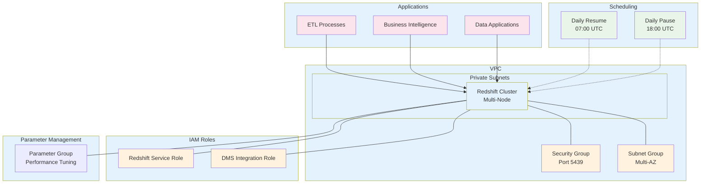

# Redshift Module

A Terraform module for creating and managing AWS Redshift data warehouse clusters with automated scheduling, security configurations, and cost optimization features.

## Overview

This module creates a production-ready Redshift cluster with:
- **Configurable cluster sizing** with multi-node support
- **Security-first approach** with VPC integration and encryption
- **Automated scheduling** with daily pause/resume for cost optimization
- **IAM role integration** for seamless data access
- **Flexible parameter groups** for performance tuning
- **Blue/Green deployment support** through companion restore module

## Architecture



## What This Module Creates

### Core Redshift Infrastructure

#### Redshift Cluster
- **Fresh cluster creation** from scratch (not from snapshot)
- Configurable node type and count for scaling
- Custom database name and master credentials
- VPC integration with private subnet deployment
- Encryption at rest and in transit support

#### Network Configuration
- **VPC Security Group** integration for network access control
- **Subnet Group** for multi-AZ placement
- **Enhanced VPC Routing** support for improved security
- **Public accessibility** toggle (typically disabled for security)

#### IAM Integration
- **Redshift Service Role** for cluster operations
- **DMS Integration Role** for data migration scenarios
- Automatic role attachment to cluster

### Cost Optimization Features

#### Automated Scheduling
- **Daily Pause**: Automatically pauses cluster at 18:00 UTC (6 PM)
- **Daily Resume**: Automatically resumes cluster at 07:00 UTC (7 AM)
- **Weekend Coverage**: Runs 7 days a week for consistent schedule
- **Cost Savings**: Up to 65% cost reduction during off-hours

#### Performance Tuning
- **Parameter Groups** for workload optimization
- **Node scaling** based on data volume and query complexity
- **Skip final snapshot** option for development environments

## Usage

### Basic Production Cluster

```hcl
module "redshift" {
  source = "../modules/redshift"
  
  # Cluster Configuration
  redshift_cluster_identifier_name = "prod-analytics-cluster"
  redshift_node_type              = "ra3.xlplus"
  redshift_num_of_nodes           = 3
  
  # Database Configuration
  redshift_database_name = "analytics"
  redshift_username      = "admin"
  redshift_password      = var.redshift_master_password # Use secure variable
  redshift_port          = 5439
  
  # Network Configuration
  redshift_subnet_group_name    = aws_redshift_subnet_group.main.name
  redshift_sg_id               = aws_security_group.redshift.id
  redshift_parameter_group_name = aws_redshift_parameter_group.main.name
  
  # Security Configuration
  redshift_publicly_accessible = false
  redshift_encrypted           = true
  redshift_skip_final_snapshot = false
  
  # IAM Roles
  redshift_role_arn     = aws_iam_role.redshift_role.arn
  redshift_dms_role_arn = aws_iam_role.dms_redshift_role.arn
  
  # Scheduling
  redshift_daily_pause  = "prod-redshift-daily-pause"
  redshift_daily_resume = "prod-redshift-daily-resume"
}
```

### Development Environment (Cost-Optimized)

```hcl
module "redshift_dev" {
  source = "../modules/redshift"
  
  # Smaller cluster for development
  redshift_cluster_identifier_name = "dev-analytics-cluster"
  redshift_node_type              = "dc2.large"
  redshift_num_of_nodes           = 1
  
  # Database Configuration
  redshift_database_name = "dev_analytics"
  redshift_username      = "admin"
  redshift_password      = var.redshift_dev_password
  redshift_port          = 5439
  
  # Network Configuration
  redshift_subnet_group_name    = aws_redshift_subnet_group.dev.name
  redshift_sg_id               = aws_security_group.redshift_dev.id
  redshift_parameter_group_name = "default.redshift-1.0"
  
  # Development Settings
  redshift_publicly_accessible = false
  redshift_encrypted           = false  # Optional for dev
  redshift_skip_final_snapshot = true   # Skip snapshots for dev
  
  # IAM Roles
  redshift_role_arn     = aws_iam_role.redshift_role.arn
  redshift_dms_role_arn = aws_iam_role.dms_redshift_role.arn
  
  # Scheduling
  redshift_daily_pause  = "dev-redshift-daily-pause"
  redshift_daily_resume = "dev-redshift-daily-resume"
}
```

### Blue/Green Deployment Integration

This module works seamlessly with the **Redshift Restore Module** for blue/green deployments:

```hcl
# Main cluster (Green)
module "redshift" {
  source = "../modules/redshift"
  count  = local.restore_redshift_from_snapshot ? 0 : 1
  
  # ... configuration
}

# Restored cluster (Blue)
module "redshift_restore" {
  source = "../modules/redshift-restore"
  count  = local.restore_redshift_from_snapshot ? 1 : 0
  
  redshift_snapshot_identifier = "prod-analytics-cluster-snapshot-2024"
  # ... other configuration
}

# Route53 DNS switching
resource "aws_route53_record" "redshift_live" {
  name = "redshift.example.com"
  records = [
    local.restore_redshift_from_snapshot
    ? module.redshift_restore[0].redshift_endpoint_address
    : module.redshift[0].redshift_endpoint_address
  ]
}
```

## Input Variables

### Required Variables

| Variable | Type | Description | Example |
|----------|------|-------------|---------|
| `redshift_cluster_identifier_name` | `string` | Unique identifier for the Redshift cluster | `"prod-analytics"` |
| `redshift_node_type` | `string` | Node type for the cluster | `"ra3.xlplus"` |
| `redshift_num_of_nodes` | `number` | Number of nodes in the cluster | `3` |
| `redshift_database_name` | `string` | Name of the default database | `"analytics"` |
| `redshift_username` | `string` | Master username for the cluster | `"admin"` |
| `redshift_password` | `string` | Master password (use secure variables) | `var.master_password` |

### Network Configuration Variables

| Variable | Type | Description |
|----------|------|-------------|
| `redshift_port` | `number` | Port for Redshift connections (default: 5439) |
| `redshift_subnet_group_name` | `string` | Name of the subnet group for VPC deployment |
| `redshift_sg_id` | `string` | Security group ID for network access control |
| `redshift_parameter_group_name` | `string` | Parameter group name for performance tuning |

### Security Configuration Variables

| Variable | Type | Description |
|----------|------|-------------|
| `redshift_publicly_accessible` | `bool` | Whether cluster is publicly accessible (recommend: false) |
| `redshift_encrypted` | `bool` | Enable encryption at rest |
| `redshift_skip_final_snapshot` | `bool` | Skip final snapshot on deletion |

### IAM Role Variables

| Variable | Type | Description |
|----------|------|-------------|
| `redshift_role_arn` | `string` | ARN of the Redshift service role |
| `redshift_dms_role_arn` | `string` | ARN of the DMS integration role |

### Scheduling Variables

| Variable | Type | Description |
|----------|------|-------------|
| `redshift_daily_pause` | `string` | Name for the daily pause scheduled action |
| `redshift_daily_resume` | `string` | Name for the daily resume scheduled action |

## Outputs

| Output | Description |
|--------|-------------|
| `redshift_endpoint` | Full Redshift cluster endpoint (hostname:port) |
| `redshift_endpoint_address` | Hostname only (used for DNS CNAME records) |
| `redshift_port` | Port number the cluster is listening on |
| `redshift_database_name` | Default database name |
| `redshift_cluster_identifier` | Unique cluster identifier |
| `redshift_arn` | ARN of the Redshift cluster |

### Using Outputs

```hcl
# Create DNS record
resource "aws_route53_record" "redshift" {
  name    = "redshift.example.com"
  type    = "CNAME"
  records = [module.redshift.redshift_endpoint_address]
}

# Reference in applications
resource "aws_ssm_parameter" "redshift_endpoint" {
  name  = "/app/redshift/endpoint"
  value = module.redshift.redshift_endpoint
}
```

## Node Types and Sizing

### Recommended Node Types

#### RA3 Instances (Latest Generation - Recommended)
- **ra3.xlplus**: 4 vCPU, 32 GB RAM, managed storage
- **ra3.4xlarge**: 12 vCPU, 96 GB RAM, managed storage  
- **ra3.16xlarge**: 48 vCPU, 384 GB RAM, managed storage

#### DC2 Instances (Previous Generation)
- **dc2.large**: 2 vCPU, 15 GB RAM, 160 GB SSD
- **dc2.8xlarge**: 32 vCPU, 244 GB RAM, 2.56 TB SSD

### Sizing Guidelines

#### Small Workloads (< 1 TB data)
```hcl
redshift_node_type     = "dc2.large"
redshift_num_of_nodes  = 1
```

#### Medium Workloads (1-10 TB data)
```hcl
redshift_node_type     = "ra3.xlplus"
redshift_num_of_nodes  = 3
```

#### Large Workloads (> 10 TB data)
```hcl
redshift_node_type     = "ra3.4xlarge"
redshift_num_of_nodes  = 6
```

## Scheduled Actions

### Automatic Pause/Resume

The module creates two scheduled actions for cost optimization:

#### Daily Pause (18:00 UTC)
- **Cron**: `cron(0 18 * * ? *)`
- **Action**: Pauses the cluster to stop compute charges
- **Storage**: Continues to be charged (unavoidable)

#### Daily Resume (07:00 UTC)
- **Cron**: `cron(0 7 * * ? *)`
- **Action**: Resumes the cluster for business hours
- **Startup**: Takes 1-2 minutes to become available

### Cost Savings Example
```
Without Scheduling:
- 24h/day × 30 days = 720 hours/month
- Cost: $720/month (assuming $1/hour)

With Scheduling (13h/day workday):
- 13h/day × 30 days = 390 hours/month  
- Cost: $390/month (46% savings)
```

## Security Best Practices

### Network Security
```hcl
# Security Group Example
resource "aws_security_group" "redshift" {
  name_prefix = "redshift-"
  vpc_id      = var.vpc_id
  
  # Only allow access from application subnets
  ingress {
    from_port   = 5439
    to_port     = 5439
    protocol    = "tcp"
    cidr_blocks = var.app_subnet_cidrs
  }
  
  # No outbound restrictions (for managed updates)
  egress {
    from_port   = 0
    to_port     = 0
    protocol    = "-1"
    cidr_blocks = ["0.0.0.0/0"]
  }
}
```

### IAM Roles
```hcl
# Redshift Service Role
resource "aws_iam_role" "redshift_role" {
  name = "redshift-service-role"
  
  assume_role_policy = jsonencode({
    Version = "2012-10-17"
    Statement = [
      {
        Action = "sts:AssumeRole"
        Effect = "Allow"
        Principal = {
          Service = "redshift.amazonaws.com"
        }
      }
    ]
  })
}

# Attach necessary policies
resource "aws_iam_role_policy_attachment" "redshift_s3_read" {
  role       = aws_iam_role.redshift_role.name
  policy_arn = "arn:aws:iam::aws:policy/AmazonS3ReadOnlyAccess"
}
```

## Parameter Groups

### Custom Parameter Group Example
```hcl
resource "aws_redshift_parameter_group" "main" {
  family = "redshift-1.0"
  name   = "custom-redshift-params"
  
  parameter {
    name  = "enable_user_activity_logging"
    value = "true"
  }
  
  parameter {
    name  = "max_concurrency_scaling_clusters"
    value = "5"
  }
  
  parameter {
    name  = "wlm_json_configuration"
    value = jsonencode([
      {
        query_group                = "dashboard"
        query_group_wild_card      = 0
        user_group                 = "dashboard_users"
        user_group_wild_card       = 0
        concurrency_scaling        = "auto"
        rules = [
          {
            rule_name      = "DashboardRule"
            predicate      = "query_execution_time > 20"
            action         = "log"
          }
        ]
        queue_type         = "auto"
        auto_wlm           = true
      }
    ])
  }
}
```

## Monitoring and Alerting

### CloudWatch Metrics
Key metrics to monitor:
- `CPUUtilization`
- `DatabaseConnections` 
- `HealthStatus`
- `MaintenanceMode`
- `NetworkReceiveThroughput`
- `NetworkTransmitThroughput`

### Example CloudWatch Alarm
```hcl
resource "aws_cloudwatch_metric_alarm" "redshift_cpu_high" {
  alarm_name          = "redshift-high-cpu"
  comparison_operator = "GreaterThanThreshold"
  evaluation_periods  = "2"
  metric_name         = "CPUUtilization"
  namespace           = "AWS/Redshift"
  period              = "300"
  statistic           = "Average"
  threshold           = "80"
  alarm_description   = "This metric monitors redshift cpu utilization"
  
  dimensions = {
    ClusterIdentifier = module.redshift.redshift_cluster_identifier
  }
}
```

## Blue/Green Deployment Strategy

This module integrates with the **Redshift Restore Module** for zero-downtime deployments:

### 1. Current State (Blue Active)
```
Applications → Blue Cluster (Production)
               Green Cluster (Not deployed)
```

### 2. Deploy Green Cluster
```hcl
# Deploy from snapshot
local.restore_redshift_from_snapshot = true
```

### 3. Test Green Cluster
```
Applications → Blue Cluster (Production)
Test Suite   → Green Cluster (Testing)
```

### 4. Switch Traffic to Green
```hcl
# Update DNS to point to Green
local.active_color = "green"
```

### 5. Decommission Blue
```
Applications → Green Cluster (Production)
               Blue Cluster (Terminated)
```

## Troubleshooting

### Common Issues

#### Cluster Won't Start
**Problem**: Cluster stuck in "creating" state  
**Solution**: Check subnet group has subnets in multiple AZs
```hcl
resource "aws_redshift_subnet_group" "main" {
  name       = "redshift-subnet-group"
  subnet_ids = var.private_subnet_ids  # Must span multiple AZs
}
```

#### Connection Timeout
**Problem**: Applications can't connect to cluster  
**Solution**: Verify security group allows inbound connections on port 5439
```bash
# Test connectivity from application server
telnet redshift-cluster.region.redshift.amazonaws.com 5439
```

#### Scheduled Actions Not Working
**Problem**: Pause/resume actions failing  
**Solution**: Ensure IAM role has proper permissions
```json
{
  "Version": "2012-10-17",
  "Statement": [
    {
      "Effect": "Allow",
      "Action": [
        "redshift:PauseCluster",
        "redshift:ResumeCluster"
      ],
      "Resource": "*"
    }
  ]
}
```

#### Performance Issues
**Problem**: Queries running slowly  
**Solution**: Consider these optimizations:
1. Increase node count for more parallel processing
2. Upgrade to newer instance types (RA3)
3. Optimize table distribution keys
4. Use appropriate sort keys
5. Run `VACUUM` and `ANALYZE` regularly

## Cost Considerations

### Compute Costs
- **On-Demand**: Pay for running hours only
- **Reserved Instances**: Up to 75% discount with 1-3 year commitment
- **Scheduled Actions**: Up to 65% savings with pause/resume

### Storage Costs
- **RA3**: Managed storage, pay for what you use
- **DC2**: Local SSD included in compute price
- **Snapshots**: Additional cost for automated/manual backups

### Example Monthly Costs (US East)
```
ra3.xlplus (3 nodes, 13h/day):
- Compute: $0.348/hour × 3 nodes × 390 hours = $406/month
- Storage: $0.024/GB/month × 10TB = $240/month
- Total: ~$646/month

dc2.large (1 node, 13h/day):
- Compute: $0.25/hour × 390 hours = $98/month
- Storage: Included
- Total: ~$98/month
```

## Related Modules

- **[Redshift Restore Module](../redshift-restore/README.md)**: Companion module for snapshot-based deployments
- **[VPC Module](../vpc/README.md)**: Network infrastructure for secure Redshift deployment
- **[Security Group Module](../security-groups/README.md)**: Network access control

## Contributing

When contributing to this module:
1. Test with both single-node and multi-node configurations
2. Verify scheduling actions work correctly
3. Ensure backward compatibility with existing deployments
4. Update cost estimates for new instance types
5. Test blue/green deployment scenarios


**Note**: This module creates AWS resources that incur costs. Redshift clusters are charged by the hour when running. Use scheduled pause/resume actions to optimize costs for non-24/7 workloads.