# S3 Admin WAF Module
A Terraform module for creating a comprehensive AWS WAFv2 Web Application Firewall with trusted IP allowlisting and AWS managed rule groups for admin interface protection.

## Overview
This module creates a security-focused WAF configuration with:

- **IP-based access control** with trusted IP allowlisting
- **AWS managed rule groups** for comprehensive threat protection
- **Configurable rule overrides** for fine-tuning protection levels
- **CloudWatch logging** with customizable retention
- **Environment-parametric design** for Test/Staging/Production deployments
- **Flexible scope support** for both CloudFront and regional resources

The module follows a **security-first approach** with managed rule groups evaluated before allow rules, ensuring malicious requests are blocked even from trusted IPs.

## Architecture

```mermaid
graph TB
    subgraph "Incoming Requests"
        REQ[HTTP/HTTPS Requests]
    end

    subgraph "WAF Rule Evaluation (Priority Order)"
        REQ --> WAF{WAFv2 Web ACL}
        
        subgraph "Priority 0-5: AWS Managed Rules"
            MGR1[Common Rule Set<br/>Priority 0]
            MGR2[IP Reputation List<br/>Priority 1] 
            MGR3[Known Bad Inputs<br/>Priority 2]
            MGR4[SQL Injection Rules<br/>Priority 3]
            MGR5[Anonymous IP List<br/>Priority 4]
            MGR6[Admin Protection<br/>Priority 5]
        end
        
        subgraph "Priority 6: Custom Rules"
            CR1[Allow Trusted IPs<br/>Priority 6]
        end
        
        WAF --> MGR1
        MGR1 --> MGR2
        MGR2 --> MGR3
        MGR3 --> MGR4
        MGR4 --> MGR5
        MGR5 --> MGR6
        MGR6 --> CR1
    end

    subgraph "IP Set Resources"
        IPSET[Trusted IPv4 IP Set<br/>Office/VPN CIDRs]
        CR1 -.-> IPSET
    end

    subgraph "Actions & Results"
        CR1 --> ALLOW[✅ ALLOW]
        CR1 --> BLOCK[❌ BLOCK]
        CR1 --> COUNT[📊 COUNT]
        CR1 --> CAPTCHA[🤖 CAPTCHA]
        CR1 --> CHALLENGE[🔐 CHALLENGE]
    end

    subgraph "Target Resources"
        ALLOW --> CF[CloudFront Distribution]
        ALLOW --> ALB[Application Load Balancer]
        ALLOW --> APIGW[API Gateway]
    end

    subgraph "Monitoring & Logging"
        WAF -.-> CW[CloudWatch Metrics]
        WAF -.-> LOGS[CloudWatch Logs]
        
        CW --> DASH[CloudWatch Dashboard]
        LOGS --> INSIGHTS[CloudWatch Insights]
    end

    subgraph "Configuration Variables"
        CONFIG[Module Variables]
        CONFIG -.-> |trusted_ip_cidrs| IPSET
        CONFIG -.-> |enable_managed_groups| MGR1
        CONFIG -.-> |enable_managed_groups| MGR2
        CONFIG -.-> |enable_managed_groups| MGR3
        CONFIG -.-> |enable_managed_groups| MGR4
        CONFIG -.-> |enable_managed_groups| MGR5
        CONFIG -.-> |enable_managed_groups| MGR6
        CONFIG -.-> |logging.enabled| LOGS
        CONFIG -.-> |admin_ip_action| CR1
    end

    classDef managed fill:#ff9999,stroke:#cc0000,stroke-width:2px
    classDef custom fill:#99ccff,stroke:#0066cc,stroke-width:2px
    classDef allow fill:#99ff99,stroke:#009900,stroke-width:2px
    classDef block fill:#ffcc99,stroke:#ff6600,stroke-width:2px
    classDef monitoring fill:#ffff99,stroke:#cccc00,stroke-width:2px

    class MGR1,MGR2,MGR3,MGR4,MGR5,MGR6 managed
    class CR1,IPSET custom
    class ALLOW,CF,ALB,APIGW allow
    class BLOCK,COUNT,CAPTCHA,CHALLENGE block
    class CW,LOGS,DASH,INSIGHTS monitoring
```



### Rule Evaluation Order
The module uses a carefully designed rule priority system:

1. **AWS Managed Rule Groups** (Priorities 0-5)
   - Common Rule Set
   - IP Reputation List
   - Known Bad Inputs
   - SQL Injection Protection
   - Anonymous IP List
   - Admin Protection Rules

2. **Trusted IP Allow Rule** (Priority 6)
   - Allows traffic from specified IP ranges
   - Evaluated after security rules

This ordering ensures that **security rules can still block malicious requests** even from trusted IP addresses.

## What This Module Creates

### Core WAF Components

**WAFv2 Web ACL**
- Configurable scope (CLOUDFRONT or REGIONAL)
- Environment-specific naming with sanitized metrics
- Flexible default action (ALLOW or BLOCK)
- CloudWatch metrics enabled for all rules

**Trusted IP Set**
- IPv4 IP set for trusted office/VPN addresses
- Referenced by the allow rule for access control
- Configurable CIDR ranges via `trusted_ip_cidrs`

**AWS Managed Rule Groups (Configurable)**
- **Common Rule Set**: General web application protection
- **IP Reputation List**: Blocks known malicious IP addresses
- **Known Bad Inputs**: Protects against common attack patterns
- **SQL Injection Rule Set**: Advanced SQLi protection
- **Anonymous IP List**: Blocks anonymizing services (VPN, Tor)
- **Admin Protection Rule Set**: Specialized admin interface protection

### Logging Infrastructure (Optional)

**CloudWatch Log Group**
- Configurable retention period (default: 30 days)
- Environment-specific naming
- Automatic cleanup on module destruction

**IAM Logging Policy**
- Service-linked role permissions for WAF logging
- Scoped to specific log group resources
- Optional creation via `logging.create_policy`

**Logging Configuration**
- Structured JSON logs for security analysis
- Integration with CloudWatch Insights
- Real-time monitoring capabilities

## Usage

### Basic Example
```hcl
module "admin_waf" {
  source = "../../../modules/s3-admin-waf"

  # Environment configuration
  name_prefix = "myapp-prod"
  environment = "Production"
  
  # WAF scope (CLOUDFRONT for global, REGIONAL for ALB/API Gateway)
  scope = "CLOUDFRONT"
  
  # Trusted IP addresses (office, VPN, etc.)
  trusted_ip_cidrs = [
    "203.0.113.0/24",    # Office network
    "198.51.100.0/24",   # VPN range
    "192.0.2.100/32"     # Admin workstation
  ]
  
  # Default action when no rules match
  default_action_allow = false  # Block by default
  
  # Admin path protection
  admin_ip_action = "BLOCK"
  admin_uri_regexes = [
    ".*/admin/.*",
    ".*/wp-admin/.*",
    ".*/administrator/.*"
  ]
  
  # Enable comprehensive managed rule protection
  enable_managed_groups = {
    common           = true
    ip_reputation    = true
    known_bad_inputs = true
    sqli             = true
    anonymous_ip     = true
    admin_protection = true
  }
  
  # Enable logging with 90-day retention
  logging = {
    enabled        = true
    log_group_name = null  # Auto-generated
    retention_days = 90
    create_policy  = true
  }
}
```

### Advanced Configuration with Rule Overrides
```hcl
module "staging_waf" {
  source = "../../../modules/s3-admin-waf"
  
  name_prefix = "myapp-staging"
  environment = "Staging"
  scope       = "REGIONAL"
  
  trusted_ip_cidrs = ["10.0.0.0/8"]  # Internal network only
  
  # More permissive for development
  default_action_allow = true
  admin_ip_action     = "COUNT"  # Monitor instead of block
  
  # Selective rule group enabling
  enable_managed_groups = {
    common           = true
    ip_reputation    = true
    known_bad_inputs = false  # Disable for testing
    sqli             = true
    anonymous_ip     = false  # Allow VPNs in staging
    admin_protection = true
  }
  
  # Override specific rules to COUNT instead of BLOCK
  managed_overrides = {
    common           = ["SizeRestrictions_BODY"]
    ip_reputation    = []
    known_bad_inputs = []
    sqli             = ["SQLi_QUERYARGUMENTS"]
    anonymous_ip     = []
    admin_protection = []
  }
  
  # Reduced logging retention for staging
  logging = {
    enabled        = true
    log_group_name = "staging-waf-logs"
    retention_days = 7
    create_policy  = true
  }
}
```

### CloudFront Integration
```hcl
resource "aws_cloudfront_distribution" "app" {
  # ... other configuration ...
  
  web_acl_id = module.admin_waf.web_acl_id
  
  # Ensure WAF is in us-east-1 for CloudFront
  depends_on = [module.admin_waf]
}
```

### Application Load Balancer Integration
```hcl
resource "aws_wafv2_web_acl_association" "alb" {
  resource_arn = aws_lb.app.arn
  web_acl_arn  = module.admin_waf.web_acl_arn
}

module "regional_waf" {
  source = "../../../modules/s3-admin-waf"
  
  # ... configuration ...
  scope = "REGIONAL"  # Required for ALB/API Gateway
}
```

## Input Variables

### Required Variables
| Variable | Type | Description |
|----------|------|-------------|
| `name_prefix` | `string` | Prefix for all resource names |
| `environment` | `string` | Environment label (used in metrics, sanitized) |

### Core Configuration Variables
| Variable | Type | Default | Description |
|----------|------|---------|-------------|
| `scope` | `string` | `"CLOUDFRONT"` | WAF scope: `CLOUDFRONT` or `REGIONAL` |
| `trusted_ip_cidrs` | `list(string)` | `[]` | List of trusted IP CIDR ranges |
| `default_action_allow` | `bool` | `true` | Default action when no rules match |
| `admin_ip_action` | `string` | `"BLOCK"` | Action for admin path rule: `BLOCK`, `COUNT`, `ALLOW`, `CAPTCHA`, `CHALLENGE` |
| `admin_uri_regexes` | `list(string)` | `[".*/admin/.*"]` | Regex patterns for admin paths |

### Managed Rule Groups Configuration
```hcl
variable "enable_managed_groups" {
  type = object({
    common           = bool  # AWS Core Rule Set
    ip_reputation    = bool  # IP Reputation List
    known_bad_inputs = bool  # Known Bad Inputs
    sqli             = bool  # SQL Injection Protection
    anonymous_ip     = bool  # Anonymous IP List
    admin_protection = bool  # Admin Protection Rules
  })
  default = {
    common           = true
    ip_reputation    = true
    known_bad_inputs = true
    sqli             = true
    anonymous_ip     = true
    admin_protection = true
  }
}
```

### Rule Override Configuration
```hcl
variable "managed_overrides" {
  type = object({
    common           = list(string)  # Rules to override in Common Rule Set
    ip_reputation    = list(string)  # Rules to override in IP Reputation
    known_bad_inputs = list(string)  # Rules to override in Known Bad Inputs
    sqli             = list(string)  # Rules to override in SQLi Protection
    anonymous_ip     = list(string)  # Rules to override in Anonymous IP
    admin_protection = list(string)  # Rules to override in Admin Protection
  })
  default = {
    common           = []
    ip_reputation    = []
    known_bad_inputs = []
    sqli             = []
    anonymous_ip     = []
    admin_protection = []
  }
}
```

### Logging Configuration
```hcl
variable "logging" {
  type = object({
    enabled        = bool    # Enable WAF logging
    log_group_name = string  # CloudWatch log group name (null = auto-generate)
    retention_days = number  # Log retention period
    create_policy  = bool    # Create IAM logging policy
  })
  default = {
    enabled        = true
    log_group_name = null
    retention_days = 30
    create_policy  = true
  }
}
```

## Outputs

### Core WAF Information
| Output | Description |
|--------|-------------|
| `web_acl_id` | WAFv2 Web ACL ID |
| `web_acl_arn` | WAFv2 Web ACL ARN |
| `web_acl_name` | WAFv2 Web ACL name |
| `web_acl_scope` | WAF scope (REGIONAL or CLOUDFRONT) |

### Monitoring and Metrics
| Output | Description |
|--------|-------------|
| `metric_base` | Sanitized base name for CloudWatch metrics |
| `managed_rule_metric_names` | Map of enabled managed rule groups to metric names |
| `custom_rule_metric_names` | Metric names for custom rules |
| `rules_active` | List of active rules in evaluation order |
| `managed_groups_enabled` | List of enabled AWS managed rule groups |

### IP Set Information
| Output | Description |
|--------|-------------|
| `trusted_ip_set_id` | Trusted IPv4 IP Set ID |
| `trusted_ip_set_arn` | Trusted IPv4 IP Set ARN |

### Logging Information
| Output | Description |
|--------|-------------|
| `logging_enabled` | Whether WAF logging is enabled |
| `log_group_name` | CloudWatch Log Group name (null if disabled) |
| `log_group_arn` | CloudWatch Log Group ARN (null if disabled) |
| `log_resource_policy_name` | CloudWatch Logs resource policy name |
| `logging_configuration_id` | WAF logging configuration ID |

## Security Features

### Defense in Depth
✅ **Multi-layered protection** with 6 AWS managed rule groups
✅ **IP reputation filtering** blocks known malicious sources
✅ **SQL injection protection** with advanced detection patterns
✅ **Anonymous IP blocking** prevents abuse from anonymizing services
✅ **Admin-specific protection** tailored for administrative interfaces

### Access Control
✅ **Trusted IP allowlisting** with CIDR range support
✅ **Configurable default actions** (allow or block unknown traffic)
✅ **Rule override capabilities** for fine-tuning protection levels
✅ **Priority-based rule evaluation** ensures security rules execute first

### Monitoring and Compliance
✅ **Comprehensive CloudWatch metrics** for all rules and rule groups
✅ **Structured logging** with configurable retention
✅ **Real-time monitoring** capabilities with CloudWatch Insights
✅ **Audit trail** for security analysis and compliance

## Rule Group Details

### AWS Managed Rules Common Rule Set
**Purpose**: General web application protection
**Protects Against**: 
- Cross-site scripting (XSS)
- Local file inclusion attacks
- Common web exploits
- Oversized request bodies

**Common Overrides**:
- `SizeRestrictions_BODY` - For file upload functionality
- `GenericRFI_BODY` - For applications with legitimate external references

### IP Reputation List
**Purpose**: Blocks traffic from known malicious IP addresses
**Protects Against**:
- Botnet sources
- Known attack origins
- Compromised systems
- Malware command & control servers

### Known Bad Inputs Rule Set
**Purpose**: Protects against common attack patterns
**Protects Against**:
- Directory traversal attempts
- Remote file inclusion
- Server-side request forgery (SSRF)
- Command injection attempts

### SQL Injection Rule Set
**Purpose**: Advanced SQL injection protection
**Protects Against**:
- SQL injection in query parameters
- SQL injection in request bodies
- Advanced SQLi techniques
- Database-specific attack patterns

**Common Overrides**:
- `SQLi_QUERYARGUMENTS` - For applications with complex query parameters

### Anonymous IP List
**Purpose**: Blocks traffic from anonymizing services
**Protects Against**:
- Tor exit nodes
- VPN services
- Proxy networks
- Anonymous hosting providers

**Note**: May need to be disabled in environments where legitimate users access via VPN.

### Admin Protection Rule Set
**Purpose**: Specialized protection for administrative interfaces
**Protects Against**:
- Admin panel specific attacks
- Privilege escalation attempts
- Authentication bypass
- Administrative function abuse

## Provider Configuration

This module requires the AWS provider to be configured for the appropriate region:

```hcl
# For CloudFront WAFs, use us-east-1
provider "aws" {
  alias  = "use1"
  region = "us-east-1"
}

module "admin_waf" {
  source = "./modules/s3-admin-waf"
  
  providers = {
    aws.use1 = aws.use1
  }
  
  # ... other configuration
}
```

For regional WAFs (ALB, API Gateway), use your target region.

## Troubleshooting

### Common Issues

**WAF Rules Not Blocking Expected Traffic**
- **Problem**: Legitimate traffic being blocked or malicious traffic allowed
- **Solution**: Review rule priorities and override configurations. Check CloudWatch metrics to identify which rules are triggering.

**CloudWatch Logging Not Working**
- **Problem**: No logs appearing in CloudWatch
- **Solution**: Verify IAM permissions and log group configuration. Ensure `logging.create_policy = true` and the log group exists.

**IP Set Updates Not Taking Effect**
- **Problem**: Changes to `trusted_ip_cidrs` not reflected in WAF behavior
- **Solution**: WAF rule updates can take several minutes to propagate. Check the IP Set in AWS Console to verify CIDR ranges.

**High False Positive Rate**
- **Problem**: Legitimate traffic being blocked by managed rules
- **Solution**: Use rule overrides to change specific rules from BLOCK to COUNT. Monitor metrics to identify problematic rules.

### Performance Considerations

**Rule Evaluation Cost**
- Each enabled managed rule group adds evaluation time
- Consider disabling unused rule groups in high-traffic scenarios
- Monitor WAF capacity units if approaching limits

**Logging Volume**
- WAF logs can be high-volume in busy applications
- Adjust retention periods based on compliance requirements
- Consider log sampling for cost optimization

## Best Practices

### Security Configuration
1. **Start restrictive**: Begin with `default_action_allow = false` and all managed groups enabled
2. **Monitor first**: Use `admin_ip_action = "COUNT"` initially to understand traffic patterns
3. **Gradual tuning**: Add rule overrides based on legitimate traffic analysis
4. **Regular review**: Periodically review CloudWatch metrics and logs

### IP Management
1. **Use specific ranges**: Avoid overly broad CIDR ranges in `trusted_ip_cidrs`
2. **Document IP sources**: Maintain clear documentation of what each IP range represents
3. **Regular audits**: Periodically review and clean up unused IP ranges
4. **Emergency access**: Maintain alternative access methods for IP changes

### Monitoring and Alerting
1. **Set up CloudWatch alarms**: Monitor for unusual traffic patterns or high block rates
2. **Regular log analysis**: Use CloudWatch Insights to analyze attack patterns
3. **Metric dashboards**: Create dashboards for rule group performance and blocked traffic
4. **Integration with SIEM**: Forward logs to security monitoring systems

### Environment-Specific Considerations
- **Production**: Enable all managed groups, use BLOCK actions, minimal overrides
- **Staging**: Consider COUNT actions for testing, selective rule group enabling
- **Development**: More permissive configuration, shorter log retention

## Version Requirements

```hcl
terraform {
  required_version = ">= 1.6.0"
  required_providers {
    aws = {
      source  = "hashicorp/aws"
      version = "~> 5.0"
    }
  }
}
```

## Contributing

When contributing to this module:

1. **Maintain security focus**: Ensure changes don't weaken default security posture
2. **Test across scopes**: Verify functionality with both CLOUDFRONT and REGIONAL scopes
3. **Update documentation**: Keep variable descriptions and examples current
4. **Monitor compatibility**: Test with various AWS managed rule group versions
5. **Performance testing**: Verify changes don't impact WAF evaluation performance

## Design Decisions

### Why These Choices?

**Rule Priority Order**: Managed security rules evaluate before allow rules to ensure malicious traffic is blocked even from trusted IPs.

**Flexible Override System**: Individual rule overrides provide fine-grained control without disabling entire rule groups.

**Environment-Based Metrics**: Sanitized environment names in metrics enable consistent monitoring across deployments.

**Optional Logging**: Logging can be expensive at scale, so it's configurable with sensible defaults.

**Provider Aliasing**: Explicit provider configuration ensures WAFs are created in the correct region for their intended scope.

This module provides a robust, production-ready WAF configuration that balances security, flexibility, and operational requirements.