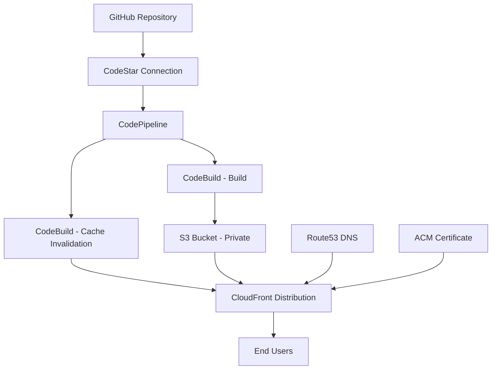

# S3 Frontend Module

A Terraform module for hosting static Single Page Applications (SPAs) with a complete CI/CD pipeline using S3, CloudFront, and AWS CodePipeline.

## Overview

This module creates a modern static SPA hosting stack with:
- **Private S3 bucket** for secure asset storage
- **CloudFront distribution** with Origin Access Control (OAC) for global content delivery
- **Complete CI/CD pipeline** with GitHub integration via CodeStar Connections
- **Security-first approach** with proper IAM policies and security headers
- **Environment-parametric design** for Test/Staging/Production deployments

The module is fully toggleable - when `enable_s3_frontend = false`, nothing is created, making it safe for conditional deployments.

## Architecture



## What This Module Creates

### Core Hosting Infrastructure

#### S3 Bucket (Private)
- Fully private bucket with Block Public Access enabled
- Custom bucket name via `var.bucket_name`
- Optional pre-delete cleanup for safe Terraform destruction

#### CloudFront Distribution
- **Origin Access Control (OAC)** - Modern replacement for OAI using SigV4 signing
- Default root object set to `index.html`
- SPA-friendly error handling:
  - `403` → `200 /index.html`
  - `404` → `200 /index.html`
- Custom domain aliases via `cf_aliases`
- ACM certificate support (must be in `us-east-1`)
- Built-in security headers policy:
  - HSTS (HTTP Strict Transport Security)
  - Referrer-Policy
  - X-Frame-Options
  - X-Content-Type-Options
  - X-XSS-Protection
  - Permissions-Policy

#### S3 Bucket Policy
- Restricts access to only the specific CloudFront distribution
- Uses `AWS:SourceArn` condition for tight security boundary
- No public access permissions

### CI/CD Pipeline (Optional)

#### CodeStar Connection
- GitHub integration (requires one-time manual authorization)
- Creates connection in `PENDING` state - manual completion required

#### CodeBuild Projects
1. **Build Project**
   - Node.js 19 runtime (matching previous Amplify setup)
   - Runs `ng build --configuration=qa`
   - Optional SNS notifications on build completion

2. **Cache Invalidation Project**
   - Performs CloudFront cache invalidations after deployment

#### CodePipeline (V2)
- **Source Stage**: GitHub via CodeStar Connection
- **Build Stage**: Angular application build
- **Deploy Stage**: S3 deployment with artifact extraction
- **Invalidate Stage**: CloudFront cache invalidation
- Dedicated S3 artifact store

#### SNS Notifications
- Optional email notifications for build events
- Configurable notification ARN

## Why OAC over OAI?

**Origin Access Identity (OAI)** is the legacy approach:
- Uses S3 canonical user in bucket policies
- Limited feature support
- Being phased out by AWS

**Origin Access Control (OAC)** is the modern approach:
- Uses SigV4 request signing
- Supports advanced S3 features (SSE-KMS, S3 Object Ownership)
- Enables precise access control with `AWS:SourceArn`
- Future-proof and actively maintained

## Usage

### Basic Example

```hcl
module "s3-frontend" {
  source = "../../../modules/s3-frontend"

  # Toggle hosting and pipeline
  enable_s3_frontend = true

  # Environment configuration
  name_prefix = "myapp-test"
  environment = "Test"
  bucket_name = "test-myapp.example.com"

  # CloudFront configuration
  cf_aliases  = ["test-myapp.example.com"]
  cf_cert_arn = "arn:aws:acm:us-east-1:123456789012:certificate/12345678-1234-1234-1234-123456789012"

  # Performance settings
  default_ttl_seconds = 0
  min_ttl_seconds     = 0

  # Cleanup behavior
  bucket_force_destroy      = true
  enable_pre_delete_cleanup = true

  # IAM roles (pre-created)
  s3_frontend_codebuild_role_arn    = "arn:aws:iam::123456789012:role/myapp-test-codebuild-role"
  s3_frontend_codepipeline_role_arn = "arn:aws:iam::123456789012:role/myapp-test-codepipeline-role"

  # GitHub integration
  frontend_codestar_connection = "arn:aws:codestar-connections:eu-west-2:123456789012:connection/12345678-1234-1234-1234-123456789012"
  full_repository_id          = "myorg/myapp-frontend"
  branch_name                 = "staging"

  # Build environment variables
  api_url              = "https://api-test.example.com"
  application_endpoint = "test-myapp.example.com"
  notification_arn     = "arn:aws:sns:eu-west-2:123456789012:build-notifications"
}
```

### DNS Configuration (External)

```hcl
resource "aws_route53_record" "frontend_cname" {
  zone_id = local.hosted_zone_id
  name    = "test-myapp.example.com"
  type    = "CNAME"
  ttl     = 300
  records = [module.s3-frontend.cloudfront_domain_name]
}
```

## Input Variables

### Required Variables

| Variable | Type | Description |
|----------|------|-------------|
| `enable_s3_frontend` | `bool` | Toggle to enable/disable the entire module |
| `name_prefix` | `string` | Prefix for all resource names |
| `environment` | `string` | Environment label (e.g., "Test", "Staging", "Production") |
| `bucket_name` | `string` | Exact S3 bucket name |
| `cf_aliases` | `list(string)` | List of custom domain names for CloudFront |
| `cf_cert_arn` | `string` | ACM certificate ARN (must be in us-east-1) |

### IAM Role Variables

| Variable | Type | Description |
|----------|------|-------------|
| `s3_frontend_codebuild_role_arn` | `string` | IAM role ARN for CodeBuild projects |
| `s3_frontend_codepipeline_role_arn` | `string` | IAM role ARN for CodePipeline |

### GitHub Integration Variables

| Variable | Type | Description |
|----------|------|-------------|
| `frontend_codestar_connection` | `string` | CodeStar Connection ARN for GitHub |
| `full_repository_id` | `string` | GitHub repository (e.g., "owner/repo") |
| `branch_name` | `string` | Git branch to build from |

### Build Configuration Variables

| Variable | Type | Description |
|----------|------|-------------|
| `api_url` | `string` | API endpoint URL for the application |
| `application_endpoint` | `string` | Frontend application domain |
| `notification_arn` | `string` | SNS topic ARN for build notifications (optional) |

### Optional Configuration Variables

| Variable | Type | Default | Description |
|----------|------|---------|-------------|
| `bucket_force_destroy` | `bool` | `false` | Allow Terraform to delete bucket with objects |
| `enable_pre_delete_cleanup` | `bool` | `false` | Empty bucket before destruction |
| `default_ttl_seconds` | `number` | `86400` | Default CloudFront cache TTL |
| `min_ttl_seconds` | `number` | `0` | Minimum CloudFront cache TTL |

## Outputs

| Output | Description |
|--------|-------------|
| `bucket_name` | S3 bucket name |
| `bucket_arn` | S3 bucket ARN |
| `cloudfront_id` | CloudFront distribution ID |
| `cloudfront_domain_name` | CloudFront distribution domain name |

## Build Process

The CodeBuild process mirrors the previous Amplify pipeline setup:

1. **Environment Setup**
   - Uses Node.js 19 via nvm
   - Installs Angular CLI 19

2. **Build Execution**
   - Runs `ng build --configuration=qa`
   - Outputs to `dist/` directory

3. **Deployment**
   - Uploads build artifacts to S3
   - Invalidates CloudFront cache

4. **Notifications** (Optional)
   - Sends SNS notification with deployment details

### Custom Build Specification

The module uses a buildspec that maintains compatibility with existing Amplify configurations. If you need to customize the build process, you can modify the Node.js version or build commands as needed.

## Security Features

### S3 Security
- ✅ Private bucket with Block Public Access enabled
- ✅ No public ACLs or bucket policies
- ✅ Access restricted to specific CloudFront distribution only

### CloudFront Security
- ✅ Origin Access Control (OAC) with SigV4 signing
- ✅ Security headers policy automatically applied
- ✅ HTTPS-only with custom SSL certificates


## Setup Instructions

### 1. Prerequisites

Ensure you have the following IAM roles created with appropriate permissions:
- CodeBuild service role
- CodePipeline service role

### 2. Deploy the Module

```hcl
terraform apply
```

### 3. Authorize GitHub Connection

**⚠️ Manual Step Required**: After Terraform creates the CodeStar Connection:

1. Go to AWS Console → Developer Tools → Connections
2. Find your connection (status: `Pending`)
3. Click "Update pending connection"
4. Complete the GitHub OAuth authorization
5. Connection status changes to `Available`

### 4. Configure DNS (Optional)

Create Route53 records pointing to the CloudFront distribution domain name.

## Troubleshooting

### Common Issues

#### CloudFront Certificate Error
**Problem**: Certificate validation fails  
**Solution**: Ensure ACM certificate is created in `us-east-1` region

#### S3 Access Denied in CloudFront
**Problem**: CloudFront cannot access S3 bucket  
**Solution**: Verify OAC is properly attached and S3 policy includes correct `AWS:SourceArn`

#### Pipeline Cannot Assume Role
**Problem**: CodeBuild/CodePipeline fails with permission errors  
**Solution**: Check IAM role trust policies allow the respective AWS services

#### Build Artifacts Not Uploaded
**Problem**: No files appear in S3 after build  
**Solution**: Verify Angular output path matches `dist/` or adjust `APP_DIST_DIR`

#### DNS Resolution Issues
**Problem**: Custom domain doesn't resolve  
**Solution**: Ensure Route53 records point to CloudFront domain name, not S3

## Design Decisions

### Why These Choices?

1. **OAC over OAI**: Modern, secure, and future-proof S3 access control
2. **Single Toggle**: `enable_s3_frontend` controls both hosting and pipeline for consistent lifecycle management
3. **Explicit Inputs**: No hidden defaults ensure predictable, environment-specific configurations
4. **Security by Default**: Built-in security headers and private-first S3 configuration
5. **Pipeline Integration**: Complete CI/CD workflow matching existing Amplify patterns

## CORS and API Integration

This module serves static assets only. For SPA → API communication:

- **CORS**: Must be configured on your API server (Laravel/Nginx)
- **Preflight Requests**: API must return `200`/`204` for `OPTIONS` requests
- **Credentials**: Use `Access-Control-Allow-Credentials: true` for cookie-based sessions
- **Origins**: API must echo the exact SPA origin in CORS headers

## Contributing

When contributing to this module:
1. Maintain backward compatibility
2. Update documentation for any new variables
3. Test across multiple environments
4. Follow Terraform best practices
5. Update examples as needed

**Note**: This module requires manual authorization of the CodeStar Connection for GitHub integration. This is an AWS security requirement and cannot be automated.