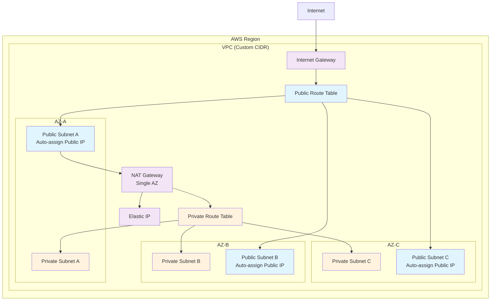

# VPC Module

A Terraform module for creating a complete AWS VPC infrastructure with public and private subnets across multiple availability zones, including Internet Gateway and optional NAT Gateway for secure, scalable networking.

## Overview

This module creates a production-ready VPC with:
- **Custom VPC** with configurable CIDR block
- **Multi-AZ deployment** across 3 availability zones for high availability
- **Public subnets** with internet access for load balancers and bastion hosts
- **Private subnets** for application servers and databases
- **Internet Gateway** for public internet access
- **Optional NAT Gateway** for private subnet outbound connectivity
- **Flexible tagging** support for resource organization

## Architecture



## What This Module Creates

### Core VPC Infrastructure

#### VPC
- Custom CIDR block (configurable)
- DNS support and DNS hostnames enabled by default
- Custom tagging support

#### Subnets (Multi-AZ)
- **3 Public Subnets** (one per AZ)
  - Auto-assign public IP enabled
  - Direct internet access via Internet Gateway
  - Ideal for load balancers, bastion hosts, NAT Gateways

- **3 Private Subnets** (one per AZ)
  - No direct internet access
  - Outbound connectivity via NAT Gateway (optional)
  - Perfect for application servers, databases, internal services

#### Internet Gateway
- Provides internet access for public subnets
- Automatically attached to VPC

#### NAT Gateway (Optional)
- **Single NAT Gateway** deployment (cost-optimized)
- Deployed in first public subnet (AZ-A)
- Provides outbound internet access for private subnets
- Includes dedicated Elastic IP
- Can be disabled via `enable_nat_gateway = false`

### Routing Infrastructure

#### Public Route Table
- Routes `0.0.0.0/0` to Internet Gateway
- Associated with all public subnets

#### Private Route Table
- Routes `0.0.0.0/0` to NAT Gateway (when enabled)
- Associated with all private subnets
- No internet route when NAT is disabled

## Usage

### Basic Example

```hcl
module "vpc" {
  source = "../modules/vpc"
  
  # VPC Configuration
  vpc_name       = "myapp-prod"
  vpc_cidr_block = "10.0.0.0/16"
  
  # Subnet Configuration
  public_subnet_cidrs  = ["10.0.1.0/24", "10.0.2.0/24", "10.0.3.0/24"]
  private_subnet_cidrs = ["10.0.10.0/24", "10.0.20.0/24", "10.0.30.0/24"]
  
  # Availability Zones
  azs = ["eu-west-2a", "eu-west-2b", "eu-west-2c"]
  
  # NAT Gateway (optional)
  enable_nat_gateway  = true
  single_nat_gateway  = true
  
  # Tagging
  tags = {
    Environment = "Production"
    Project     = "MyApp"
    Owner       = "DevOps Team"
  }
}
```

### Development Environment (No NAT)

```hcl
module "vpc_dev" {
  source = "../modules/vpc"
  
  vpc_name       = "myapp-dev"
  vpc_cidr_block = "10.1.0.0/16"
  
  public_subnet_cidrs  = ["10.1.1.0/24", "10.1.2.0/24", "10.1.3.0/24"]
  private_subnet_cidrs = ["10.1.10.0/24", "10.1.20.0/24", "10.1.30.0/24"]
  
  azs = data.aws_availability_zones.available.names
  
  # Disable NAT for cost savings in dev
  enable_nat_gateway = false
  
  tags = {
    Environment = "Development"
    Project     = "MyApp"
  }
}
```

### Using Data Sources for AZs

```hcl
data "aws_availability_zones" "available" {
  state = "available"
}

module "vpc" {
  source = "../modules/vpc"
  
  vpc_name       = "myapp-staging"
  vpc_cidr_block = "10.2.0.0/16"
  
  public_subnet_cidrs  = ["10.2.1.0/24", "10.2.2.0/24", "10.2.3.0/24"]
  private_subnet_cidrs = ["10.2.10.0/24", "10.2.20.0/24", "10.2.30.0/24"]
  
  # Use first 3 available AZs
  azs = slice(data.aws_availability_zones.available.names, 0, 3)
  
  enable_nat_gateway = true
  single_nat_gateway = true
  
  tags = local.common_tags
}
```

## Input Variables

### Required Variables

| Variable | Type | Description | Example |
|----------|------|-------------|---------|
| `vpc_name` | `string` | Name for the VPC and resource naming | `"myapp-prod"` |
| `vpc_cidr_block` | `string` | CIDR block for the VPC | `"10.0.0.0/16"` |
| `public_subnet_cidrs` | `list(string)` | CIDR blocks for public subnets (3 required) | `["10.0.1.0/24", "10.0.2.0/24", "10.0.3.0/24"]` |
| `private_subnet_cidrs` | `list(string)` | CIDR blocks for private subnets (3 required) | `["10.0.10.0/24", "10.0.20.0/24", "10.0.30.0/24"]` |
| `azs` | `list(string)` | Availability zones for subnet deployment (3 required) | `["eu-west-2a", "eu-west-2b", "eu-west-2c"]` |

### Optional Variables

| Variable | Type | Default | Description |
|----------|------|---------|-------------|
| `tags` | `map(string)` | `{}` | Additional tags to apply to all resources |
| `enable_dns_hostnames` | `bool` | `true` | Enable DNS hostnames in the VPC |
| `enable_dns_support` | `bool` | `true` | Enable DNS support in the VPC |
| `enable_nat_gateway` | `bool` | `true` | Create NAT Gateway for private subnet internet access |
| `single_nat_gateway` | `bool` | `true` | Use single NAT Gateway (cost-optimized) |
| `aws_region` | `string` | `"eu-west-2"` | AWS region for deployment |

## Outputs

| Output | Type | Description |
|--------|------|-------------|
| `vpc_id` | `string` | VPC ID |
| `vpc_cidr_block` | `string` | VPC CIDR block |
| `public_subnet_ids` | `list(string)` | List of public subnet IDs |
| `private_subnet_ids` | `list(string)` | List of private subnet IDs |
| `private_subnet_cidrs` | `list(string)` | List of private subnet CIDR blocks |
| `internet_gateway_id` | `string` | Internet Gateway ID |
| `nat_gateway_id` | `string` | NAT Gateway ID (null if disabled) |
| `nat_gateway_public_ip` | `string` | NAT Gateway public IP (null if disabled) |
| `private_rt_id` | `string` | Private route table ID |

### Using Outputs

```hcl
# Reference VPC resources in other modules
module "app_servers" {
  source = "../modules/ec2"
  
  subnet_ids = module.vpc.private_subnet_ids
  vpc_id     = module.vpc.vpc_id
}

module "load_balancer" {
  source = "../modules/alb"
  
  subnet_ids = module.vpc.public_subnet_ids
  vpc_id     = module.vpc.vpc_id
}
```

## CIDR Planning

### Recommended CIDR Schemes

#### Small Environment (< 1000 resources)
```hcl
vpc_cidr_block = "10.0.0.0/16"  # 65,536 IPs

public_subnet_cidrs = [
  "10.0.1.0/24",   # 256 IPs per AZ
  "10.0.2.0/24",
  "10.0.3.0/24"
]

private_subnet_cidrs = [
  "10.0.10.0/24",  # 256 IPs per AZ
  "10.0.20.0/24",
  "10.0.30.0/24"
]
```

#### Medium Environment (1000-10000 resources)
```hcl
vpc_cidr_block = "10.0.0.0/16"  # 65,536 IPs

public_subnet_cidrs = [
  "10.0.1.0/24",   # 256 IPs per AZ
  "10.0.2.0/24",
  "10.0.3.0/24"
]

private_subnet_cidrs = [
  "10.0.16.0/20",  # 4,096 IPs per AZ
  "10.0.32.0/20",
  "10.0.48.0/20"
]
```

#### Large Environment (> 10000 resources)
```hcl
vpc_cidr_block = "10.0.0.0/8"   # 16,777,216 IPs

public_subnet_cidrs = [
  "10.0.1.0/24",   # 256 IPs per AZ
  "10.1.1.0/24",
  "10.2.1.0/24"
]

private_subnet_cidrs = [
  "10.0.0.0/16",   # 65,536 IPs per AZ
  "10.1.0.0/16",
  "10.2.0.0/16"
]
```

## High Availability Considerations

### Multi-AZ Deployment
- Subnets span 3 availability zones for maximum resilience
- Applications can be deployed across all AZs for fault tolerance
- Database clusters can use different AZs for backup replicas

### NAT Gateway Considerations

#### Single NAT Gateway (Default - Cost Optimized)
- ✅ **Cost Effective**: One NAT Gateway reduces costs
- ⚠️ **Single Point of Failure**: AZ-A failure affects all private subnets
- 📊 **Use Case**: Development, testing, cost-sensitive environments

#### Multiple NAT Gateways (High Availability)
For production environments requiring maximum uptime, consider extending the module:

```hcl
# Future enhancement - not currently implemented
enable_nat_gateway = true
single_nat_gateway = false  # Would create NAT in each AZ
```

## Security Considerations

### Network Segmentation
- **Public Subnets**: Only for resources that need direct internet access
- **Private Subnets**: For sensitive applications and databases
- **Route Isolation**: Private subnets cannot be accessed directly from internet

### Best Practices
1. **Principle of Least Privilege**: Only place necessary resources in public subnets
2. **Defense in Depth**: Use Security Groups and NACLs for additional security
3. **Monitoring**: Enable VPC Flow Logs for network monitoring
4. **Encryption**: Enable encryption in transit and at rest for sensitive data

### Security Groups Integration
```hcl
# Example: Create security group using VPC module outputs
resource "aws_security_group" "web_servers" {
  name_prefix = "web-servers-"
  vpc_id      = module.vpc.vpc_id
  
  ingress {
    from_port   = 80
    to_port     = 80
    protocol    = "tcp"
    cidr_blocks = [module.vpc.vpc_cidr_block]
  }
}
```

## Cost Optimization

### NAT Gateway Costs
- **NAT Gateway**: ~$45/month + data processing charges
- **Alternative**: NAT Instance (more complex, less reliable, cheaper)
- **Development**: Disable NAT Gateway entirely (`enable_nat_gateway = false`)

### Elastic IP Costs
- **Free**: When attached to running NAT Gateway
- **Charged**: If NAT Gateway is stopped but EIP remains allocated

## Troubleshooting

### Common Issues

#### Subnet CIDR Overlaps
**Problem**: CIDR blocks overlap between subnets  
**Solution**: Ensure all subnet CIDRs are within VPC CIDR and don't overlap
```bash
# Check for overlaps
terraform plan  # Will show CIDR conflicts
```

#### Insufficient IP Addresses
**Problem**: Running out of IPs in subnets  
**Solution**: Use larger CIDR blocks (smaller suffix numbers)
```hcl
# Instead of /24 (256 IPs), use /20 (4,096 IPs)
private_subnet_cidrs = ["10.0.16.0/20", "10.0.32.0/20", "10.0.48.0/20"]
```

#### Private Instances Can't Access Internet
**Problem**: Resources in private subnets can't reach internet  
**Solution**: Ensure NAT Gateway is enabled and properly configured
```hcl
enable_nat_gateway = true
single_nat_gateway = true
```

#### Wrong Availability Zones
**Problem**: Specified AZs don't exist in region  
**Solution**: Use data source to get available AZs
```hcl
data "aws_availability_zones" "available" {
  state = "available"
}

azs = slice(data.aws_availability_zones.available.names, 0, 3)
```

## Integration Examples

### With Application Load Balancer
```hcl
resource "aws_lb" "app_lb" {
  name               = "app-lb"
  internal           = false
  load_balancer_type = "application"
  subnets            = module.vpc.public_subnet_ids
  
  security_groups = [aws_security_group.alb_sg.id]
}
```

### With RDS Subnet Group
```hcl
resource "aws_db_subnet_group" "database" {
  name       = "database-subnet-group"
  subnet_ids = module.vpc.private_subnet_ids
  
  tags = {
    Name = "Database subnet group"
  }
}
```

### With EKS Cluster
```hcl
resource "aws_eks_cluster" "cluster" {
  name     = "app-cluster"
  role_arn = aws_iam_role.eks_role.arn
  
  vpc_config {
    subnet_ids         = concat(module.vpc.public_subnet_ids, module.vpc.private_subnet_ids)
    endpoint_private_access = true
    endpoint_public_access  = true
  }
}
```

## Design Decisions

### Why These Choices?

1. **Fixed 3-AZ Design**: Provides optimal balance of availability and complexity
2. **Single NAT Gateway**: Cost-optimized default while maintaining functionality  
3. **Separate Public/Private Route Tables**: Clear network segmentation
4. **Auto-assign Public IPs**: Simplifies public subnet usage
5. **For_each Implementation**: Enables predictable subnet creation and naming
6. **DNS Enabled by Default**: Most applications require DNS resolution

### Alternative Approaches Considered

- **Multiple NAT Gateways**: Higher cost but better availability
- **NAT Instances**: Lower cost but more operational overhead  
- **Variable AZ Count**: More flexibility but increased complexity
- **Database Subnets**: Separate tier for databases (can be added as enhancement)

## Extending the Module

### Adding Database Subnets
```hcl
# Future enhancement
variable "database_subnet_cidrs" {
  type        = list(string)
  description = "CIDR blocks for database subnets"
  default     = []
}

resource "aws_subnet" "database" {
  for_each = var.database_subnet_cidrs != [] ? {
    a = { cidr = var.database_subnet_cidrs[0], az = var.azs[0] }
    b = { cidr = var.database_subnet_cidrs[1], az = var.azs[1] }
    c = { cidr = var.database_subnet_cidrs[2], az = var.azs[2] }
  } : {}
  
  vpc_id            = aws_vpc.vpc.id
  cidr_block        = each.value.cidr
  availability_zone = each.value.az
  tags              = merge(var.tags, { Name = "${var.vpc_name}-database-${each.key}" })
}
```

### Adding VPC Flow Logs
```hcl
resource "aws_flow_log" "vpc_flow_log" {
  iam_role_arn    = aws_iam_role.flow_log_role.arn
  log_destination = aws_cloudwatch_log_group.vpc_flow_log.arn
  traffic_type    = "ALL"
  vpc_id          = aws_vpc.vpc.id
}
```

## Contributing

When contributing to this module:
1. Maintain the 3-AZ design pattern
2. Consider cost implications of changes
3. Update documentation for new variables
4. Test across multiple environments
5. Follow Terraform best practices
6. Preserve backward compatibility

**Note**: This module creates AWS resources that may incur costs. The NAT Gateway is the primary cost component (~$45/month). Consider disabling it in development environments to reduce costs.